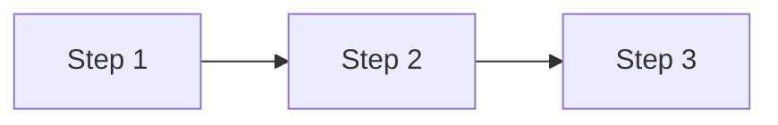

# Technical Content Creation Guide

_Transform technical books into engaging, learnable content_

---

## 📋 Table of Contents

1. [Core Method](#-core-method)
2. [Content Structure](#-content-structure)
3. [Teaching Techniques](#-teaching-techniques)
4. [Visual Elements](#-visual-elements)
5. [Docusaurus Guidelines](#-docusaurus-guidelines)
6. [Quick Reference](#-quick-reference)

---

## 🎯 Core Method

| Step | Action |
|------|--------|
| 1 | Research authoritative sources |
| 2 | Add superior teaching methods |
| 3 | Create organized, learnable content |

**Key Principle:** Established technical structure + enhanced learning methods

---

## 📋 Content Structure

### Numbered TOC

```markdown
## Table of Contents

1. [Introduction](#1-introduction)
2. [Main Topic](#2-main-topic)
   - 2.1. [Subtopic](#21-subtopic)
3. [Summary](#3-summary)
```

### Header Numbering

| Level | Format | Example |
|-------|--------|---------|
| Main | `## 1.` | `## 1. Introduction` |
| Sub | `### 1.1.` | `### 1.1. Subtopic` |
| Sub-sub | `#### 1.1.1.` | `#### 1.1.1. Detail` |

### Navigation Footer

```markdown
---
**Previous:** [Link] | **Next:** [Link]
```

### Rules

- ✅ Every header appears in TOC
- ✅ Hierarchical numbering (1, 1.1, 1.2, 2, 2.1)
- ✅ Working anchor links
- ❌ No orphaned entries

---

## 🎨 Teaching Techniques

### Analogies First

```markdown
**In plain English:** [Simple explanation]
**In technical terms:** [Actual concept]
**Why it matters:** [Real-world benefit]
```

### Progressive Examples

```
Simple concept → Intermediate application → Advanced implementation
```

### Insight Boxes

```markdown
> **💡 Insight**
>
> [Key knowledge that connects concepts to broader patterns]
```

### Complexity Breakdown

| ❌ Avoid | ✅ Prefer |
|----------|-----------|
| "Complex enterprise architecture with microservices, event sourcing, and CQRS patterns" | "1. Break problem → 2. Solve pieces → 3. Connect solutions → 4. Scale system" |

### Code Examples

- **Explain before showing** — Context first, code second
- **Use realistic examples** — Actual commands that work
- **Show expected output** — What should happen
- **Test everything** — All examples must work

---

## 🖼️ Visual Elements

### Diagrams

**Docusaurus:** Use SVG, React components, or Mermaid

```jsx
// React component
import FlowDiagram from '@site/src/components/FlowDiagram';
<FlowDiagram steps={['Input', 'Process', 'Output']} />

// Mermaid

```

**Plain Markdown:** Use ASCII

```
Step 1  →  Step 2  →  Step 3
```

### Emoji Usage

Use strategically for visual hierarchy:

| Category | Emojis |
|----------|--------|
| **Sections** | 🎯 Goals · 📋 Lists · 🚀 Performance · 🔧 Implementation · 🌊 Pipelines |
| **Callouts** | 💡 Insight · ⚠️ Warning · 📝 Note · 🎓 Learning · 🔒 Security |
| **Content** | 💻 Code · 🖥️ Systems · 🌐 Network · ⏱️ Performance · 📊 Metrics |

**Guidelines:** 1-2 per section, strategic placement, match meaning to content

---

## 📚 Docusaurus Guidelines

### Color Palette (Primary Style)

| Token | Hex | Usage |
|-------|-----|-------|
| **Primary** | `#4a90d9` | Links, accents, primary actions |
| **Blue** | `#3b82f6` | Primary diagram elements |
| **Purple** | `#8b5cf6` | Secondary elements, categories |
| **Green** | `#10b981` | Success, positive, completion |
| **Orange** | `#f59e0b` | Warning, attention, caution |
| **Red** | `#ef4444` | Error, danger, negative |
| **Slate** | `#64748b` | Neutral, borders, muted text |

**Mermaid diagram styling:**
```
style NodeName fill:#3b82f6,color:#fff
```

### Prefer SVG/React Over ASCII

| Feature | ASCII | SVG/React |
|---------|:-----:|:---------:|
| Responsive | ❌ | ✅ |
| Dark mode | ❌ | ✅ |
| Interactive | ❌ | ✅ |
| Accessible | ❌ | ✅ |

### Diagram Options

```jsx
// Option 1: Inline SVG
<svg viewBox="0 0 200 100">
  <rect x="10" y="10" width="80" height="40" fill="#3b82f6" rx="4"/>
  <text x="50" y="35" textAnchor="middle" fill="white">Step 1</text>
</svg>

// Option 2: Custom React component
import FlowDiagram from '@site/src/components/FlowDiagram';
<FlowDiagram steps={['Input', 'Process', 'Output']} />

// Option 3: Mermaid (requires plugin)

```

### Interactive Code Blocks

Install `@docusaurus/theme-live-codeblock` for live editing:

```jsx
// docusaurus.config.ts
themes: ['@docusaurus/theme-live-codeblock'],
```

````markdown
```jsx live
function Demo() {
  const [count, setCount] = useState(0);
  return (
    <button onClick={() => setCount(c => c + 1)}>
      Clicked {count} times
    </button>
  );
}
```
````

| ✅ Use For | ❌ Don't Use For |
|------------|------------------|
| UI components | Backend code |
| Algorithm demos | CLI commands |
| State management | Config files |
| "Try it yourself" value | External dependencies |

### Component Organization

```
docs/
├── src/components/
│   ├── diagrams/           # FlowDiagram.tsx, ArchitectureDiagram.tsx
│   └── callouts/           # Custom callout components
└── docs/
    └── *.md                # Content files
```

---

## ✅ Quick Reference

### Structure Checklist

- [ ] Numbered TOC with working anchor links
- [ ] Consistent header numbering (1, 1.1, 1.2)
- [ ] Previous/Next navigation links

### Teaching Checklist

- [ ] Start with analogies ("In plain English")
- [ ] Use progressive examples (simple → advanced)
- [ ] Include insight boxes for key concepts
- [ ] Add visual diagrams (SVG for Docusaurus)
- [ ] Break complex concepts into numbered steps
- [ ] Explain context before showing code

### Quality Checklist

- [ ] All code examples tested and working
- [ ] Clear progression from simple to advanced
- [ ] Concepts connected to broader patterns
- [ ] Interactive demos where beneficial (Docusaurus)

---

_Transform complex technical content into learnable knowledge_
