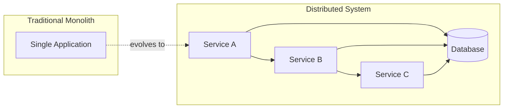
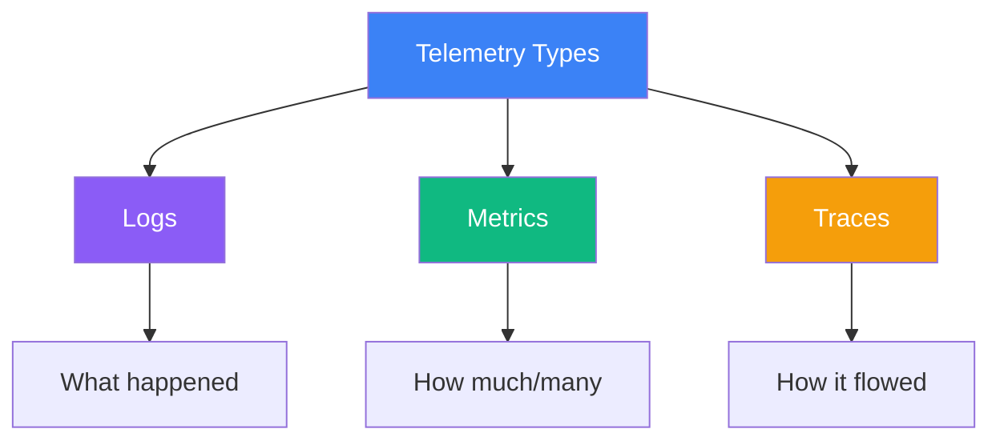
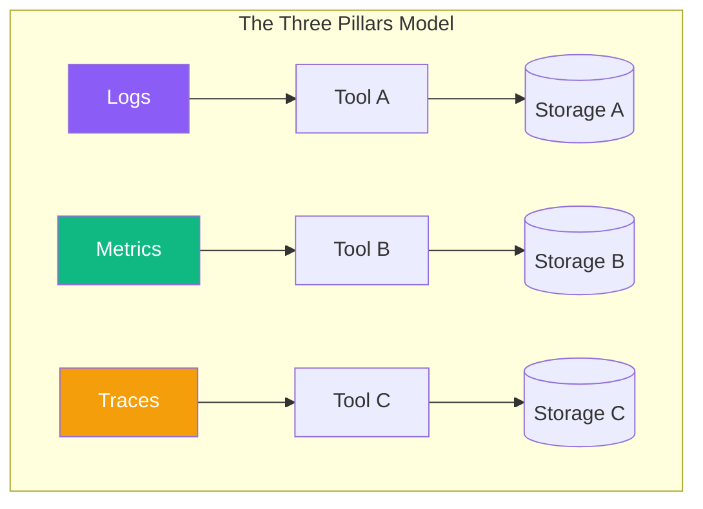
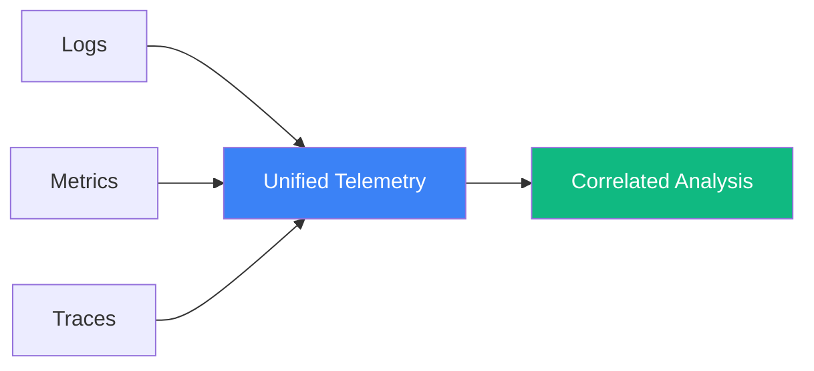

import { FlowDiagram, ComparisonDiagram, LayerDiagram } from '@site/src/components/diagrams';

# 🎯 Chapter 1: The State of Modern Observability

> **"History is not the past but a map of the past, drawn from a particular point of view, to be useful to the modern traveler."**
>
> — Henry Glassie

---

## 📋 Table of Contents

1. [Introduction](#1-introduction)
2. [What Is Observability?](#2-what-is-observability)
   - 2.1. [Distributed Systems](#21-distributed-systems)
   - 2.2. [Resources vs. Transactions](#22-resources-vs-transactions)
3. [Understanding Telemetry](#3-understanding-telemetry)
   - 3.1. [Telemetry Data Types](#31-telemetry-data-types)
   - 3.2. [Telemetry Attributes](#32-telemetry-attributes)
4. [The Three Pillars Problem](#4-the-three-pillars-problem)
5. [A Single Braid of Data](#5-a-single-braid-of-data)
6. [Summary](#6-summary)

---

## 1. Introduction

**In plain English:** Modern software is like a city with millions of moving parts—cars, buses, pedestrians, traffic lights—all interacting simultaneously. Observability is your map and traffic monitoring system that helps you understand what's happening and why.

**In technical terms:** Observability is the practice of understanding the internal state of a system by examining its external outputs (telemetry data).

**Why it matters:** Without observability, debugging production issues in distributed systems becomes nearly impossible—like finding a needle in a haystack while blindfolded.

Before we dive into OpenTelemetry specifically, let's establish a shared vocabulary and understand the landscape of modern observability.

---

## 2. What Is Observability?

### 2.1. Distributed Systems

Modern applications aren't monoliths running on a single server. They're **distributed systems**—collections of independent services communicating over networks.



> **💡 Insight**
>
> In distributed systems, failures don't look like crashes—they look like slowness, timeouts, and weird behavior that only happens in production. This is why traditional debugging approaches fail.

### 2.2. Resources vs. Transactions

Understanding observability requires distinguishing between two fundamental concepts:

| Concept | Description | Examples |
|---------|-------------|----------|
| **Resources** | The infrastructure that runs your code | CPUs, memory, disk, containers, pods |
| **Transactions** | The work your system performs | HTTP requests, database queries, user actions |

**Resource observability** answers: "Is my infrastructure healthy?"

**Transaction observability** answers: "Is my application working correctly for users?"

<ComparisonDiagram
  left={{
    title: "Resource View",
    items: ["CPU: 45%", "Memory: 2.1GB", "Disk I/O: 12MB/s", "Network: 100Mbps"],
    color: "#3b82f6"
  }}
  right={{
    title: "Transaction View",
    items: ["Request: GET /api/users", "Duration: 234ms", "Status: 200 OK", "User: customer_123"],
    color: "#10b981"
  }}
/>

> **💡 Insight**
>
> Most production problems aren't caused by resource exhaustion—they're caused by transactions interacting in unexpected ways. You need both views to understand your system.

---

## 3. Understanding Telemetry

**In plain English:** Telemetry is the data your system produces about itself—like a car's dashboard showing speed, fuel level, and engine temperature.

**In technical terms:** Telemetry is machine-readable data emitted by software to describe its runtime behavior.

### 3.1. Telemetry Data Types

There are three primary types of telemetry data:

| Type | What It Captures | Best For |
|------|------------------|----------|
| **Logs** | Discrete events with timestamps | Debugging specific issues, audit trails |
| **Metrics** | Numerical measurements over time | Alerting, dashboards, trends |
| **Traces** | Request flow across services | Understanding distributed transactions |



### 3.2. Telemetry Attributes

Raw telemetry data isn't very useful without **context**. Attributes add meaning:

```json
// Log without context - not very helpful
{"message": "Connection failed"}

// Log with attributes - much more useful
{
  "message": "Connection failed",
  "service": "payment-service",
  "database": "postgres-primary",
  "customer_id": "cust_12345",
  "retry_count": 3,
  "error_code": "CONN_TIMEOUT"
}
```

> **💡 Insight**
>
> The quality of your observability is directly proportional to the quality of your attributes. Rich, consistent attributes are what enable you to correlate data across different telemetry types.

---

## 4. The Three Pillars Problem

For years, the industry talked about the "three pillars of observability"—logs, metrics, and traces. But this framing created problems:



**The problems with this model:**

1. ❌ **Data silos** — Each pillar lives in its own tool with its own format
2. ❌ **No correlation** — Can't easily connect a metric spike to the logs that explain it
3. ❌ **Duplicate effort** — Teams instrument the same code three different ways
4. ❌ **Inconsistent attributes** — Same concept named differently across pillars

> **⚠️ Warning**
>
> The "three pillars" metaphor suggests these data types are separate and independent. In reality, they're deeply interconnected—a metric anomaly often leads you to traces, which lead you to logs. Treating them separately makes debugging harder.

---

## 5. A Single Braid of Data

OpenTelemetry introduces a better mental model: instead of three separate pillars, think of telemetry as a **single braid** of interconnected data.



**What makes this work:**

| Feature | Benefit |
|---------|---------|
| **Shared context** | All signals carry the same trace ID, service name, and attributes |
| **Unified collection** | One pipeline handles all telemetry types |
| **Semantic conventions** | Standard names for common concepts |
| **Correlation** | Jump from a metric to related traces to specific logs |

<ComparisonDiagram
  left={{
    title: "Before: Investigating",
    items: [
      "1. See metric spike in Tool A",
      "2. Search logs in Tool B",
      "3. Guess traces in Tool C",
      "4. Repeat until found"
    ],
    color: "#ef4444"
  }}
  right={{
    title: "After: Correlated",
    items: [
      "1. See metric spike",
      "2. Click to see traces",
      "3. Click to see logs",
      "4. Understand problem"
    ],
    color: "#10b981"
  }}
  centerLabel="vs"
/>

> **💡 Insight**
>
> The braid model doesn't just make debugging easier—it enables entirely new capabilities. When your data is correlated, you can use machine learning to automatically find patterns across millions of data points that no human could spot manually.

---

## 6. Summary

### 🎓 Key Takeaways

1. **Distributed systems require observability** — Traditional debugging doesn't work when requests span multiple services

2. **Telemetry has three types** — Logs (events), metrics (measurements), traces (request flows)

3. **Context is everything** — Attributes transform raw data into actionable insights

4. **The "three pillars" model is limiting** — Treating logs, metrics, and traces separately creates silos

5. **The "braid" model is better** — Unified, correlated telemetry enables faster debugging and new capabilities

### ✅ What's Next

Now that you understand the observability landscape and its challenges, you're ready to learn why OpenTelemetry specifically is the solution. The next chapter explains the problems OpenTelemetry solves and why it's become the industry standard.

---

**Previous:** [Introduction](/) | **Next:** [Chapter 2: Why Use OpenTelemetry?](./chapter-2-why-opentelemetry)
