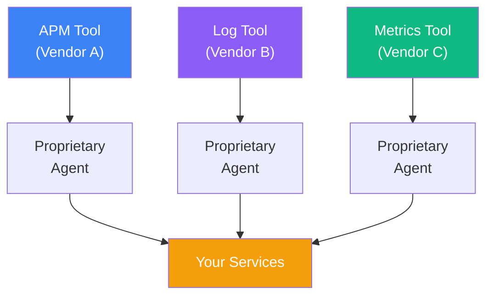
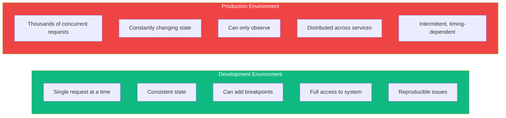
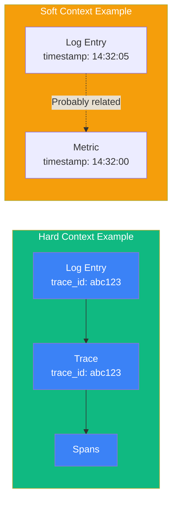
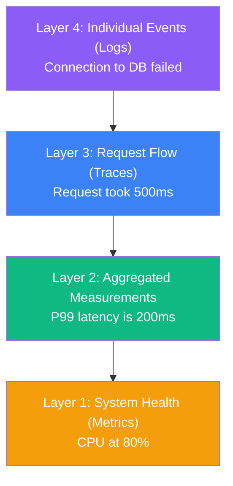
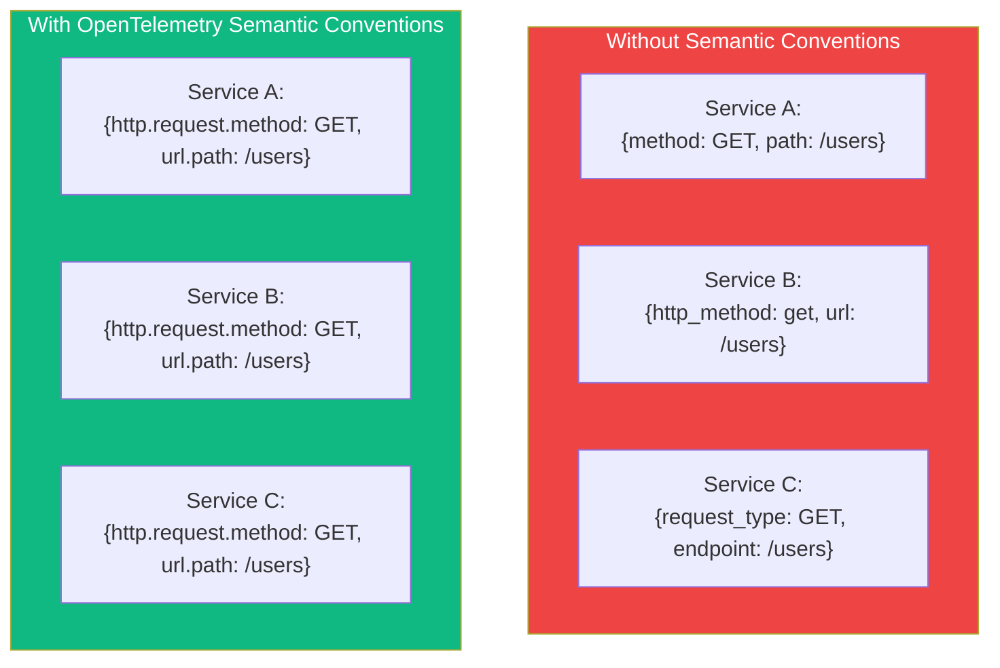
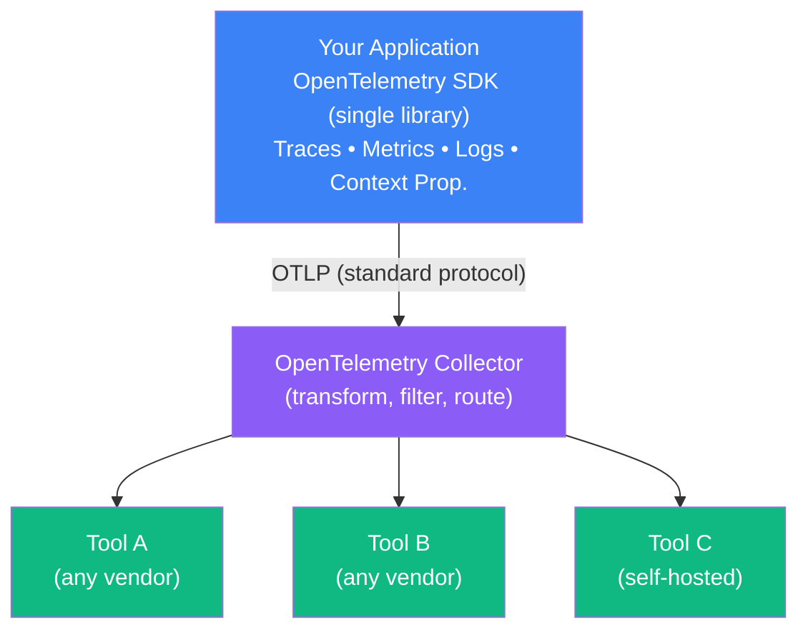

import { FlowDiagram, ComparisonDiagram, LayerDiagram, PipelineDiagram } from '@site/src/components/diagrams';

# 🎯 Chapter 2: Why Use OpenTelemetry?

> **"A map is not the actual territory, but if correctly made, it has a similar structure to the territory and therefore is useful."**
>
> — Alfred Korzybski

---

## 📋 Table of Contents

1. [Introduction](#1-introduction)
2. [Production Monitoring: The Status Quo](#2-production-monitoring-the-status-quo)
3. [The Challenges of Production Debugging](#3-the-challenges-of-production-debugging)
4. [The Importance of Telemetry](#4-the-importance-of-telemetry)
   - 4.1. [Hard Context vs. Soft Context](#41-hard-context-vs-soft-context)
   - 4.2. [Telemetry Layering](#42-telemetry-layering)
   - 4.3. [Semantic Telemetry](#43-semantic-telemetry)
5. [What People Actually Need](#5-what-people-actually-need)
6. [Why OpenTelemetry Is the Answer](#6-why-opentelemetry-is-the-answer)
7. [Summary](#7-summary)

---

## 1. Introduction

**In plain English:** Imagine trying to understand why your city's traffic is jammed, but each neighborhood uses different road signs, different measurement systems, and different reporting tools that don't talk to each other.

**In technical terms:** Production debugging in modern systems fails because telemetry data lacks standardization, correlation, and the context needed to understand complex distributed interactions.

**Why it matters:** OpenTelemetry solves these fundamental problems, enabling you to understand your systems in ways that were previously impossible.

---

## 2. Production Monitoring: The Status Quo

Most organizations have accumulated a patchwork of monitoring tools over time:

**Problems with this approach:**

| Problem | Impact |
|---------|--------|
| **Vendor lock-in** | Expensive migrations, limited choices |
| **Multiple agents** | Resource overhead, complexity |
| **Inconsistent data** | Can't correlate across tools |
| **Proprietary formats** | Data trapped in silos |

> **💡 Insight**
>
> Organizations often spend more time managing their monitoring infrastructure than actually using it to improve their systems.

---

## 3. The Challenges of Production Debugging

Production problems are fundamentally different from development bugs:

### Why Production Debugging Is Hard

Consider a user complaint: "The checkout page is slow."

To understand this, you need to answer:

1. **Which request?** (Millions happen daily)
2. **Which services were involved?** (Could be 10+ microservices)
3. **What was the database doing?** (Connection pools? Slow queries?)
4. **What else was happening?** (Other traffic? Deployments? Incidents?)

Without correlated telemetry, each question requires searching through different tools with different query languages and different time formats.

> **⚠️ Warning**
>
> The most dangerous production issues are the ones that only happen under specific conditions—high load, specific user patterns, or unusual timing. These are exactly the issues that are hardest to reproduce in development.

---

## 4. The Importance of Telemetry

### 4.1. Hard Context vs. Soft Context

**In plain English:** Hard context is a direct link (like a hyperlink). Soft context is a clue that might help you find related information (like searching by timestamp).

**In technical terms:**

| Context Type | Definition | Example | Reliability |
|--------------|------------|---------|-------------|
| **Hard Context** | Explicit identifiers linking data | Trace ID, Span ID | 100% accurate |
| **Soft Context** | Shared attributes that suggest relation | Timestamp, service name | Requires inference |

> **💡 Insight**
>
> OpenTelemetry's superpower is providing hard context across all telemetry types. Every log, metric, and trace can share the same trace ID, enabling instant correlation.

### 4.2. Telemetry Layering

Telemetry works best in layers, each adding more detail:

**How layers work together:**

1. **Metrics** alert you that something is wrong (high error rate)
2. **Traces** show you which requests are affected
3. **Logs** explain exactly what happened

### 4.3. Semantic Telemetry

**In plain English:** Everyone agrees to call the same things by the same names.

**In technical terms:** Semantic conventions are standardized attribute names and values that ensure telemetry from different sources can be correlated and analyzed together.

> **💡 Insight**
>
> Semantic conventions are what make observability tools actually useful. Without them, you'd spend all your time mapping field names instead of solving problems.

---

## 5. What People Actually Need

After talking to thousands of engineers, the observability community has identified core needs:

| Need | Description |
|------|-------------|
| **Vendor neutrality** | Freedom to choose and change tools |
| **Unified instrumentation** | One way to instrument, works everywhere |
| **Correlation** | Connect metrics, traces, and logs |
| **Low overhead** | Minimal impact on application performance |
| **Extensibility** | Customize for specific use cases |
| **Community support** | Active development, wide adoption |

---

## 6. Why OpenTelemetry Is the Answer

OpenTelemetry addresses every challenge we've discussed:

### 🔧 Architecture That Solves Real Problems

### ✅ How OpenTelemetry Solves Each Problem

| Problem | OpenTelemetry Solution |
|---------|----------------------|
| Vendor lock-in | Standard protocol (OTLP) works with any backend |
| Multiple agents | Single SDK for all telemetry types |
| Inconsistent data | Semantic conventions ensure consistency |
| No correlation | Shared context (trace ID) links all data |
| Resource overhead | Efficient batching and sampling |
| Proprietary formats | Open standard, open source |

> **💡 Insight**
>
> OpenTelemetry isn't just a library—it's an industry movement. All major cloud providers, APM vendors, and observability tools now support it. Your instrumentation investment is protected.

### 🌍 Industry Adoption

OpenTelemetry is:
- 🏛️ Part of the **Cloud Native Computing Foundation** (CNCF)
- 📈 Second most active CNCF project (after Kubernetes)
- ✅ Supported by **AWS, Azure, Google Cloud, Datadog, Splunk**, and 40+ other vendors
- 🔧 Available for **11+ programming languages**

---

## 7. Summary

### 🎓 Key Takeaways

1. **Production debugging is fundamentally hard** — Distributed systems, concurrent requests, and timing issues make traditional debugging ineffective

2. **Hard context beats soft context** — Direct links between telemetry (trace IDs) are far more useful than timestamp-based guessing

3. **Telemetry works in layers** — Metrics for alerting, traces for understanding flow, logs for details

4. **Semantic conventions matter** — Standard names enable analysis across your entire system

5. **OpenTelemetry solves real problems** — Vendor neutrality, unified instrumentation, correlation, and community support

### ✅ What's Next

Now you understand *why* OpenTelemetry exists. The next chapter dives into *what* OpenTelemetry actually is—its components, signals, and how they work together.

---

**Previous:** [Chapter 1: State of Modern Observability](./chapter-1-state-of-observability) | **Next:** [Chapter 3: OpenTelemetry Overview](./chapter-3-opentelemetry-overview)
