import { FlowDiagram, ComparisonDiagram, LayerDiagram, PipelineDiagram } from '@site/src/components/diagrams';

# 🔍 Chapter 3: OpenTelemetry Overview

> **"You can't communicate complexity, only an awareness of it."**
>
> — Alan Perlis

---

## 📋 Table of Contents

1. [Introduction](#1-introduction)
2. [Primary Observability Signals](#2-primary-observability-signals)
   - 2.1. [Traces](#21-traces)
   - 2.2. [Metrics](#22-metrics)
   - 2.3. [Logs](#23-logs)
3. [Observability Context](#3-observability-context)
   - 3.1. [The Context Layer](#31-the-context-layer)
   - 3.2. [Attributes and Resources](#32-attributes-and-resources)
4. [Semantic Conventions](#4-semantic-conventions)
5. [OpenTelemetry Protocol (OTLP)](#5-opentelemetry-protocol-otlp)
6. [Compatibility and Future-Proofing](#6-compatibility-and-future-proofing)
7. [Summary](#7-summary)

---

## 1. Introduction

**In plain English:** OpenTelemetry provides three types of "sensors" for your application—each capturing different information. Combined with a universal translator (context), they give you complete visibility.

**In technical terms:** OpenTelemetry defines three signals (traces, metrics, logs), a context propagation mechanism, and semantic conventions that together form a complete observability framework.

**Why it matters:** Understanding these components is essential for effective instrumentation and for getting the most out of your observability data.

---

## 2. Primary Observability Signals

OpenTelemetry supports three primary signals, each optimized for different use cases:

```mermaid
graph LR
    Metrics["📊 Metrics<br/>How much?<br/>Aggregated measurements<br/>over time"]
    Traces["📍 Traces<br/>Where?<br/>Request flow<br/>across services"]
    Logs["📝 Logs<br/>What happened?<br/>Discrete events<br/>with detailed information"]

    style Metrics fill:#3b82f6,color:#fff
    style Traces fill:#8b5cf6,color:#fff
    style Logs fill:#10b981,color:#fff
```



### 2.1. Traces

**In plain English:** A trace is like a detailed receipt showing every step of a request as it travels through your system.

**In technical terms:** A trace represents a single request's journey through a distributed system, consisting of spans that capture individual operations.


**Key trace concepts:**

| Concept | Description |
|---------|-------------|
| **Trace** | The complete journey of a request |
| **Span** | A single operation within a trace |
| **Span Context** | Trace ID + Span ID that links spans |
| **Parent/Child** | Relationship between spans |
| **Events** | Timestamped messages within a span |
| **Attributes** | Key-value metadata on spans |

> **💡 Insight**
>
> Traces are the backbone of distributed debugging. They answer the question "what happened to this specific request?" in a way that logs and metrics cannot.

### 2.2. Metrics

**In plain English:** Metrics are like a car's dashboard gauges—they show you aggregated measurements that help you understand overall system health.

**In technical terms:** Metrics are numerical measurements collected at regular intervals, optimized for aggregation and alerting.

```mermaid
graph TD
    Counter["Counter<br/>• Always increases or resets<br/>• Example: http_requests_total = 15,234<br/>• Use for: Counting events, calculating rates"]
    Gauge["Gauge<br/>• Can go up or down<br/>• Example: current_temperature = 72.5<br/>• Use for: Current values that fluctuate"]
    Histogram["Histogram<br/>• Samples observations into buckets<br/>• Example: request_duration_seconds<br/>• Use for: Latency distributions, percentiles"]

    style Counter fill:#3b82f6,color:#fff
    style Gauge fill:#8b5cf6,color:#fff
    style Histogram fill:#10b981,color:#fff
```



**Metrics vs. Traces:**

| Aspect | Metrics | Traces |
|--------|---------|--------|
| **Data volume** | Low (aggregated) | High (per-request) |
| **Query speed** | Fast | Slower |
| **Best for** | Alerting, dashboards | Debugging specific issues |
| **Cardinality** | Must be controlled | Can have high cardinality |

> **⚠️ Warning**
>
> High-cardinality metrics (too many unique label combinations) can explode your metrics storage costs. Be thoughtful about which attributes you add to metrics.

### 2.3. Logs

**In plain English:** Logs are the detailed journal entries your application writes—capturing specific events with all their details.

**In technical terms:** Logs are timestamped, structured records of discrete events that occur during system operation.


> **💡 Insight**
>
> The magic of OpenTelemetry logs is the trace_id and span_id fields. These let you jump directly from a log message to the complete request context—something that was impossible before correlated telemetry.

---

## 3. Observability Context

### 3.1. The Context Layer

**In plain English:** Context is like a package tracking number that follows your request everywhere it goes, ensuring all related data can be connected.

**In technical terms:** Context is metadata that propagates through your system, linking telemetry data across service boundaries.


**What propagates:**

| Field | Purpose |
|-------|---------|
| **Trace ID** | Unique identifier for the entire request |
| **Span ID** | Identifier for the current operation |
| **Trace Flags** | Sampling decisions, debug flags |
| **Trace State** | Vendor-specific information |
| **Baggage** | User-defined key-value pairs |

### 3.2. Attributes and Resources

**Attributes** describe individual operations:
```yaml
# Span attributes
http.request.method: "POST"
http.route: "/api/users"
http.response.status_code: 201
user.id: "user_12345"
```

**Resources** describe where telemetry comes from:
```yaml
# Resource attributes
service.name: "user-service"
service.version: "1.2.3"
deployment.environment: "production"
host.name: "prod-server-01"
cloud.provider: "aws"
cloud.region: "us-east-1"
```

> **💡 Insight**
>
> Resources are set once at startup and attached to all telemetry. Attributes are set per-span/metric/log. This distinction helps keep telemetry efficient.

---

## 4. Semantic Conventions

**In plain English:** Everyone agrees to call the same things by the same names—like how all countries use the same road signs.

**In technical terms:** Semantic conventions are standardized attribute names and values defined by OpenTelemetry.

```mermaid
graph TD
    HTTP["HTTP Requests<br/>• http.request.method → GET, POST<br/>• http.response.status_code → 200, 404, 500<br/>• url.path → /api/users"]
    DB["Database Operations<br/>• db.system → postgresql, mysql<br/>• db.name → users_db<br/>• db.operation → SELECT, INSERT"]
    MSG["Messaging<br/>• messaging.system → kafka, rabbitmq<br/>• messaging.destination.name → orders-queue<br/>• messaging.operation → publish, receive"]

    style HTTP fill:#3b82f6,color:#fff
    style DB fill:#8b5cf6,color:#fff
    style MSG fill:#10b981,color:#fff
```



**Why conventions matter:**

| Without Conventions | With Conventions |
|--------------------|------------------|
| "method", "http_method", "request_method" | "http.request.method" |
| Every team invents their own names | Everyone uses the same names |
| Can't correlate across services | Easy correlation everywhere |
| Tools can't provide smart features | Tools understand your data |

> **💡 Insight**
>
> Semantic conventions enable the ecosystem. APM tools can automatically build dependency maps because they know `db.system` always means the database type. Dashboards work across any service because everyone uses the same attribute names.

---

## 5. OpenTelemetry Protocol (OTLP)

**In plain English:** OTLP is the universal language that all OpenTelemetry components speak.

**In technical terms:** OTLP is the native protocol for transmitting telemetry data, supporting gRPC and HTTP transports.


**OTLP characteristics:**

| Feature | Benefit |
|---------|---------|
| **Single protocol** | One way to send all signal types |
| **Efficient** | Binary encoding, compression support |
| **Flexible transport** | gRPC (fast) or HTTP (firewall-friendly) |
| **Widely supported** | 40+ vendors accept OTLP directly |

---

## 6. Compatibility and Future-Proofing

OpenTelemetry is designed for long-term stability:

```mermaid
graph TD
    Stable["Stable APIs v1.0+<br/>• Never break backward compatibility<br/>• Safe to use in production<br/>• Any changes are purely additive"]
    Experimental["Experimental Features<br/>• May change based on feedback<br/>• Clearly marked in documentation<br/>• Move to stable after proven"]
    Deprecated["Deprecated Features<br/>• Will work for at least 1 year<br/>• Clear migration path provided<br/>• Warnings in documentation"]

    style Stable fill:#10b981,color:#fff
    style Experimental fill:#f59e0b,color:#fff
    style Deprecated fill:#ef4444,color:#fff
```



> **💡 Insight**
>
> Instrument once, use forever. OpenTelemetry's stability guarantees mean you won't have to rewrite instrumentation every time you update. This is why it's safe to invest heavily in OpenTelemetry.

---

## 7. Summary

### 🎓 Key Takeaways

1. **Three signals, one framework** — Traces, metrics, and logs each serve different purposes but share context

2. **Traces are the backbone** — They show the complete journey of requests and link all other data

3. **Context makes it work** — Propagated context (trace IDs) is what enables correlation

4. **Semantic conventions are essential** — Standard names enable tooling and cross-service analysis

5. **OTLP is the universal protocol** — One protocol for all signals, supported everywhere

6. **Stability is guaranteed** — Safe to invest in OpenTelemetry long-term

### ✅ What's Next

Now you understand what OpenTelemetry provides. The next chapter dives into the architecture—how the API, SDK, and Collector work together to make observability happen.

---

**Previous:** [Chapter 2: Why Use OpenTelemetry?](./chapter-2-why-opentelemetry) | **Next:** [Chapter 4: The OpenTelemetry Architecture](./chapter-4-architecture)
