import { FlowDiagram, ComparisonDiagram, LayerDiagram, PipelineDiagram, ArchitectureDiagram } from '@site/src/components/diagrams';

# 🏗️ Chapter 4: The OpenTelemetry Architecture

> **"I have always found that plans are useless, but planning is indispensable."**
>
> — President Dwight D. Eisenhower

---

## 📋 Table of Contents

1. [Introduction](#1-introduction)
2. [Application Telemetry](#2-application-telemetry)
   - 2.1. [Library Instrumentation](#21-library-instrumentation)
   - 2.2. [The OpenTelemetry API](#22-the-opentelemetry-api)
   - 2.3. [The OpenTelemetry SDK](#23-the-opentelemetry-sdk)
3. [Infrastructure Telemetry](#3-infrastructure-telemetry)
4. [Telemetry Pipelines](#4-telemetry-pipelines)
5. [The Collector](#5-the-collector)
   - 5.1. [Receivers](#51-receivers)
   - 5.2. [Processors](#52-processors)
   - 5.3. [Exporters](#53-exporters)
6. [Putting It All Together](#6-putting-it-all-together)
7. [Summary](#7-summary)

---

## 1. Introduction

**In plain English:** OpenTelemetry has a modular architecture—like LEGO blocks that snap together. You can use just the pieces you need, and swap out components without rebuilding everything.

**In technical terms:** OpenTelemetry separates concerns into distinct components (API, SDK, Collector) that communicate through well-defined interfaces.

**Why it matters:** Understanding the architecture helps you make better decisions about instrumentation, deployment, and troubleshooting.

---

## 2. Application Telemetry

Application telemetry comes from code running in your services. Here's how the pieces fit together:


### 2.1. Library Instrumentation

**In plain English:** Instead of manually adding logging to every HTTP call, instrumentation libraries do it automatically.

**In technical terms:** Instrumentation libraries wrap or hook into existing libraries to automatically emit telemetry.

```mermaid
graph TD
    Native["Native Instrumentation<br/>• Built into the library itself<br/>• Best performance and accuracy<br/>• Example: A database driver with built-in tracing"]
    InstLib["Instrumentation Libraries<br/>• Wraps existing libraries<br/>• Added separately from the library<br/>• Example: opentelemetry-instrumentation-http"]
    Auto["Auto-Instrumentation (Agents)<br/>• Automatically instruments many libraries at once<br/>• Language-specific (Java agent, Python auto-instrumentation)<br/>• Quickest to set up, less customization"]

    style Native fill:#10b981,color:#fff
    style InstLib fill:#3b82f6,color:#fff
    style Auto fill:#8b5cf6,color:#fff
```



> **💡 Insight**
>
> Start with auto-instrumentation to get quick visibility, then add custom instrumentation for your business logic. You don't have to choose one or the other.

### 2.2. The OpenTelemetry API

**In plain English:** The API is the vocabulary—the standard way to say "start a trace" or "record a metric" that works everywhere.

**In technical terms:** The API provides interfaces for creating telemetry, with no actual implementation. It's safe to depend on from libraries.

```mermaid
graph TD
    subgraph API["API Package"]
        Interfaces["Defines interfaces only (Tracer, Meter, Logger)<br/>• Zero or minimal dependencies<br/>• No-op by default (does nothing until SDK is registered)<br/>• Safe for library authors to depend on<br/>• Stable: backward-compatible forever"]
        Example["Example API usage:<br/>tracer = getTracer('my-service')<br/>span = tracer.startSpan('process-order')<br/>span.setAttribute('order.id', orderId)<br/>span.end()"]

        Interfaces --> Example
    end

    style API fill:#8b5cf6,color:#fff
    style Interfaces fill:#3b82f6,color:#fff
    style Example fill:#10b981,color:#fff
```



**Why separate API from SDK?**

| Concern | API | SDK |
|---------|-----|-----|
| Who uses it? | Library authors | Application developers |
| Dependencies | None/minimal | Many (exporters, processors) |
| Stability | Never changes | Can evolve |
| Default behavior | No-op | Active telemetry |

### 2.3. The OpenTelemetry SDK

**In plain English:** The SDK is the actual engine—it processes, batches, and sends your telemetry data.

**In technical terms:** The SDK implements the API interfaces and provides the machinery for collecting and exporting telemetry.

```mermaid
graph TD
    subgraph SDK["SDK"]
        Providers["Providers (TracerProvider, MeterProvider, etc.)<br/>• Create and manage Tracers/Meters/Loggers<br/>• Hold configuration and state"]
        Resource["Resource<br/>• Describes the entity producing telemetry<br/>• service.name, host.name, k8s.pod.name, etc."]
        Samplers["Samplers<br/>• Decide which traces to record<br/>• AlwaysOn, AlwaysOff, TraceIdRatioBased, etc."]
        Processors["Processors<br/>• Process data before export<br/>• BatchProcessor (batches for efficiency)<br/>• SimpleProcessor (immediate export)"]
        Exporters["Exporters<br/>• Send data to backends<br/>• OTLP, Jaeger, Prometheus, Console, etc."]

        Providers --> Resource
        Resource --> Samplers
        Samplers --> Processors
        Processors --> Exporters
    end

    style SDK fill:#3b82f6,color:#fff
    style Providers fill:#8b5cf6,color:#fff
    style Resource fill:#10b981,color:#fff
    style Samplers fill:#f59e0b,color:#fff
    style Processors fill:#3b82f6,color:#fff
    style Exporters fill:#10b981,color:#fff
```



---

## 3. Infrastructure Telemetry

Not all telemetry comes from application code. Infrastructure telemetry captures:

```mermaid
graph TD
    Host["Host Metrics<br/>• CPU, memory, disk, network<br/>• Collected by Collector's hostmetrics receiver"]
    Container["Container Metrics<br/>• Docker/containerd stats<br/>• Resource limits and usage"]
    K8s["Kubernetes Metrics<br/>• Pod, node, cluster metrics<br/>• Events and object states"]
    Cloud["Cloud Provider Metrics<br/>• AWS CloudWatch, Azure Monitor, GCP Cloud Monitoring<br/>• Managed service metrics"]

    style Host fill:#3b82f6,color:#fff
    style Container fill:#8b5cf6,color:#fff
    style K8s fill:#10b981,color:#fff
    style Cloud fill:#f59e0b,color:#fff
```



> **💡 Insight**
>
> Application telemetry tells you WHAT happened. Infrastructure telemetry tells you WHERE it happened and with what resources. You need both for complete observability.

---

## 4. Telemetry Pipelines

A telemetry pipeline connects sources to destinations:

```mermaid
graph LR
    App1["App 1"]
    App2["App 2"]
    Infra["Infra"]
    Collection["Collection<br/>• Receive data<br/>• Parse formats<br/>• Validate"]
    Processing["Processing<br/>• Transform<br/>• Filter<br/>• Sample<br/>• Enrich"]
    Backend["Backend<br/>or<br/>Storage"]

    App1 --> Collection
    App2 --> Collection
    Infra --> Collection
    Collection --> Processing
    Processing --> Backend

    style App1 fill:#3b82f6,color:#fff
    style App2 fill:#3b82f6,color:#fff
    style Infra fill:#8b5cf6,color:#fff
    style Collection fill:#10b981,color:#fff
    style Processing fill:#f59e0b,color:#fff
    style Backend fill:#3b82f6,color:#fff
```



---

## 5. The Collector

**In plain English:** The Collector is like a post office—it receives packages (telemetry) from many sources, sorts and processes them, then delivers to the right destinations.

**In technical terms:** The OpenTelemetry Collector is a vendor-agnostic proxy that receives, processes, and exports telemetry data.


### 5.1. Receivers

**Receivers** accept telemetry data from various sources:

| Receiver | Purpose |
|----------|---------|
| **otlp** | Native OpenTelemetry protocol |
| **jaeger** | Jaeger traces |
| **prometheus** | Prometheus metrics |
| **hostmetrics** | System metrics (CPU, memory, etc.) |
| **filelog** | Parse log files |
| **kafka** | Consume from Kafka |

### 5.2. Processors

**Processors** transform data in the pipeline:

| Processor | Purpose |
|-----------|---------|
| **batch** | Group data for efficient export |
| **filter** | Drop unwanted telemetry |
| **transform** | Modify attributes using OTTL |
| **attributes** | Add/remove/modify attributes |
| **tail_sampling** | Sample based on complete traces |
| **k8sattributes** | Add Kubernetes metadata |

### 5.3. Exporters

**Exporters** send data to backends:

| Exporter | Destination |
|----------|-------------|
| **otlp** | Any OTLP-compatible backend |
| **prometheus** | Prometheus server |
| **jaeger** | Jaeger backend |
| **elasticsearch** | Elasticsearch |
| **debug** | Console output for debugging |

```yaml
# Example Collector Configuration
receivers:
  otlp:
    protocols:
      grpc:
        endpoint: 0.0.0.0:4317
      http:
        endpoint: 0.0.0.0:4318

processors:
  batch:
    timeout: 1s
    send_batch_size: 1024

exporters:
  otlp:
    endpoint: "backend.example.com:4317"

service:
  pipelines:
    traces:
      receivers: [otlp]
      processors: [batch]
      exporters: [otlp]
```

> **💡 Insight**
>
> The Collector is optional—you can export directly from SDKs to backends. But using a Collector provides benefits: it offloads processing from your app, allows configuration changes without redeployment, and provides a buffer against backend unavailability.

---

## 6. Putting It All Together

Here's how all components interact in a typical deployment:

```mermaid
graph TD
    subgraph Pod1["Pod 1"]
        subgraph Service["Your Service"]
            Code["Your Code<br/>+ Manual Spans"]
            AutoInst["Auto-Instrument<br/>(HTTP, DB...)"]
            Code --> SDK1
            AutoInst --> SDK1
            SDK1["OTel SDK<br/>(in-process)"]
        end

        Sidecar["Collector Sidecar<br/>• Receives from service<br/>• Adds k8s attributes<br/>• Batches and forwards"]

        SDK1 -->|OTLP localhost| Sidecar
    end

    Gateway["Collector Gateway<br/>(shared pool)<br/>• Sampling<br/>• Filtering<br/>• Routing"]

    Jaeger["Jaeger<br/>(Traces)"]
    Prometheus["Prometheus<br/>(Metrics)"]
    Logging["Logging<br/>Backend"]

    Sidecar -->|OTLP| Gateway
    Gateway --> Jaeger
    Gateway --> Prometheus
    Gateway --> Logging

    style Pod1 fill:#3b82f6,color:#fff
    style Service fill:#8b5cf6,color:#fff
    style Code fill:#10b981,color:#fff
    style AutoInst fill:#10b981,color:#fff
    style SDK1 fill:#f59e0b,color:#fff
    style Sidecar fill:#3b82f6,color:#fff
    style Gateway fill:#8b5cf6,color:#fff
    style Jaeger fill:#10b981,color:#fff
    style Prometheus fill:#10b981,color:#fff
    style Logging fill:#10b981,color:#fff
```



---

## 7. Summary

### 🎓 Key Takeaways

1. **Separation of concerns** — API for interfaces, SDK for implementation, Collector for pipeline

2. **API is safe for libraries** — Zero dependencies, no-op by default, stable forever

3. **SDK is for applications** — Configuration, sampling, processing, exporting

4. **Collector is flexible** — Receive any format, process as needed, export anywhere

5. **Pipelines are configurable** — Receivers → Processors → Exporters

6. **Multiple deployment options** — Sidecar, gateway, or both

### ✅ What's Next

Now you understand the architecture. The next chapter gets practical—showing you exactly how to instrument your applications with OpenTelemetry.

---

**Previous:** [Chapter 3: OpenTelemetry Overview](./chapter-3-opentelemetry-overview) | **Next:** [Chapter 5: Instrumenting Applications](./chapter-5-instrumenting-applications)
