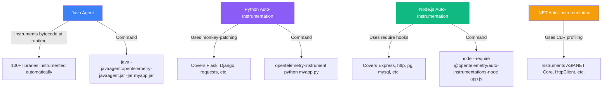
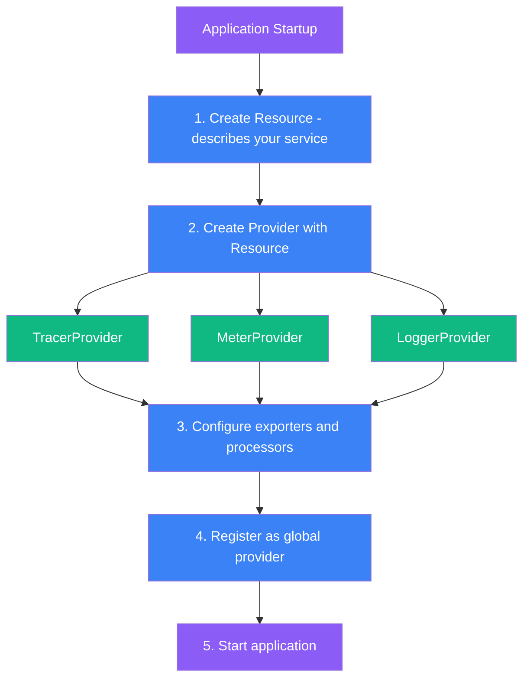
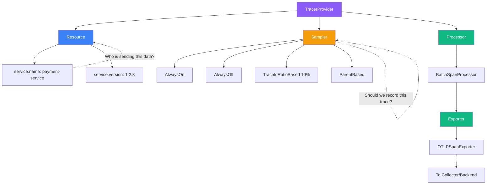
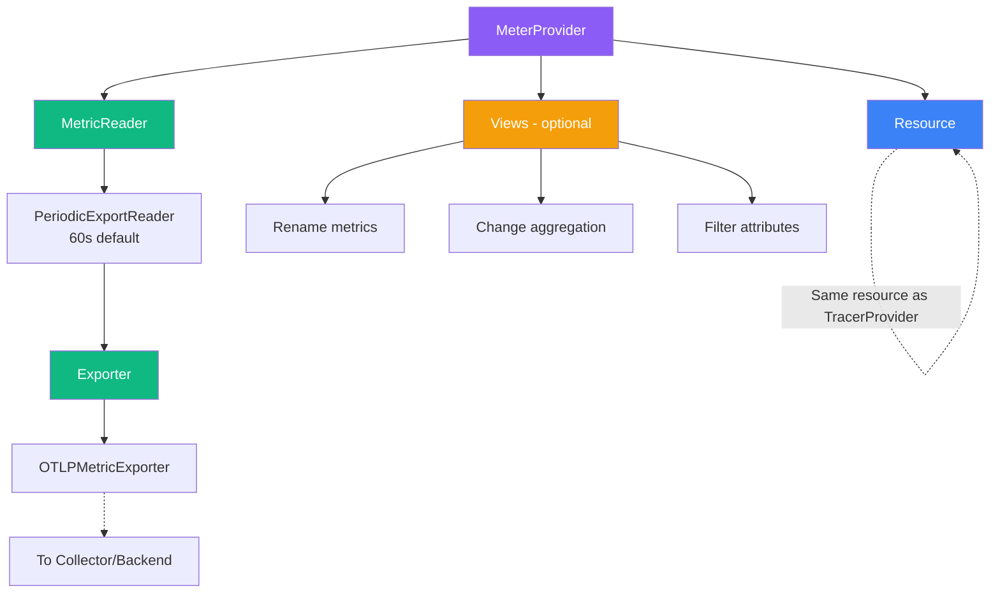
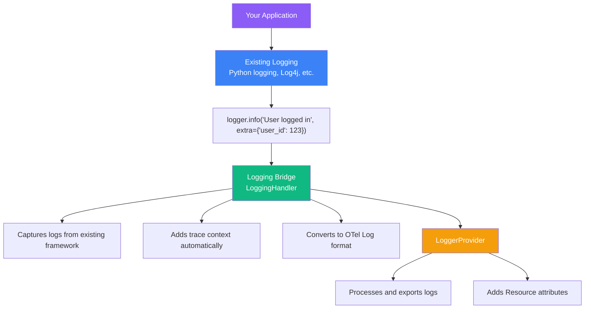

import { FlowDiagram, ComparisonDiagram, LayerDiagram, PipelineDiagram } from '@site/src/components/diagrams';

# 🔧 Chapter 5: Instrumenting Applications

> **"It is easier to write an incorrect program than understand a correct one."**
>
> — Alan Perlis

---

## 📋 Table of Contents

1. [Introduction](#1-introduction)
2. [Agents and Automated Setup](#2-agents-and-automated-setup)
3. [Installing the SDK](#3-installing-the-sdk)
   - 3.1. [Registering Providers](#31-registering-providers)
   - 3.2. [TracerProvider](#32-tracerprovider)
   - 3.3. [MeterProvider](#33-meterprovider)
   - 3.4. [LoggerProvider](#34-loggerprovider)
4. [Configuration Best Practices](#4-configuration-best-practices)
5. [Attaching Resources](#5-attaching-resources)
6. [Installing Instrumentation Libraries](#6-installing-instrumentation-libraries)
7. [Instrumenting Your Code](#7-instrumenting-your-code)
   - 7.1. [Creating Spans](#71-creating-spans)
   - 7.2. [Recording Metrics](#72-recording-metrics)
   - 7.3. [Emitting Logs](#73-emitting-logs)
8. [The Complete Setup Checklist](#8-the-complete-setup-checklist)
9. [Summary](#9-summary)

---

## 1. Introduction

**In plain English:** Instrumenting an application is like installing sensors and dashboards in your car—you're adding the ability to see what's happening under the hood.

**In technical terms:** Instrumentation is the process of adding code to emit telemetry data (traces, metrics, logs) from your application.

**Why it matters:** Without instrumentation, your application is a black box. With proper instrumentation, you can understand exactly what's happening at every step.

---

## 2. Agents and Automated Setup

The fastest way to get started is with **auto-instrumentation**:



**When to use auto-instrumentation:**

| Scenario | Recommendation |
|----------|---------------|
| Getting started quickly | ✅ Use auto-instrumentation |
| Instrumenting third-party libraries | ✅ Use auto-instrumentation |
| Need custom business metrics | Add manual instrumentation |
| Performance-critical code | Consider manual instrumentation |

> **💡 Insight**
>
> Auto-instrumentation and manual instrumentation aren't mutually exclusive. Use auto-instrumentation as your foundation, then add manual instrumentation for business-specific telemetry.

---

## 3. Installing the SDK

### 3.1. Registering Providers

Each signal type has its own **Provider** that must be registered:



### 3.2. TracerProvider

The **TracerProvider** manages trace collection:



**Python example:**

```python
from opentelemetry import trace
from opentelemetry.sdk.trace import TracerProvider
from opentelemetry.sdk.trace.export import BatchSpanProcessor
from opentelemetry.exporter.otlp.proto.grpc.trace_exporter import OTLPSpanExporter
from opentelemetry.sdk.resources import Resource

# 1. Create Resource
resource = Resource.create({
    "service.name": "payment-service",
    "service.version": "1.2.3",
    "deployment.environment": "production"
})

# 2. Create TracerProvider with Resource
provider = TracerProvider(resource=resource)

# 3. Add BatchSpanProcessor with OTLP exporter
processor = BatchSpanProcessor(OTLPSpanExporter())
provider.add_span_processor(processor)

# 4. Register globally
trace.set_tracer_provider(provider)

# 5. Get a tracer to use
tracer = trace.get_tracer("payment-service")
```

### 3.3. MeterProvider

The **MeterProvider** manages metric collection:



### 3.4. LoggerProvider

The **LoggerProvider** manages log collection and bridges existing logging libraries:



> **💡 Insight**
>
> You don't need to rewrite your logging code! OpenTelemetry provides bridges that capture logs from your existing logging library and enrich them with trace context.

---

## 4. Configuration Best Practices

Use **environment variables** for configuration—it's the standard approach:

```
Common Environment Variables
────────────────────────────

# Service identification
OTEL_SERVICE_NAME=payment-service
OTEL_RESOURCE_ATTRIBUTES=service.version=1.2.3,deployment.environment=production

# Exporter configuration
OTEL_EXPORTER_OTLP_ENDPOINT=http://collector:4317
OTEL_EXPORTER_OTLP_PROTOCOL=grpc

# Sampling
OTEL_TRACES_SAMPLER=parentbased_traceidratio
OTEL_TRACES_SAMPLER_ARG=0.1

# Propagation
OTEL_PROPAGATORS=tracecontext,baggage

# Logging
OTEL_LOG_LEVEL=info
```

**Benefits of environment variables:**

| Benefit | Explanation |
|---------|-------------|
| **No code changes** | Change configuration without rebuilding |
| **12-factor compliant** | Standard cloud-native practice |
| **Container-friendly** | Easy to set in Kubernetes/Docker |
| **Separation of concerns** | Config separate from code |

---

## 5. Attaching Resources

**Resources** describe the entity producing telemetry:

```mermaid
graph TD
    R[Resource Attributes]

    R --> S[Service Attributes]
    S --> S1["service.name → payment-service (required!)"]
    S --> S2["service.version → 1.2.3"]
    S --> S3["service.namespace → shop"]

    R --> D[Deployment Attributes]
    D --> D1["deployment.environment → production"]

    R --> H[Host Attributes - auto-detected]
    H --> H1["host.name → prod-server-01"]
    H --> H2["host.type → n1-standard-4"]

    R --> C[Cloud Attributes - auto-detected]
    C --> C1["cloud.provider → gcp"]
    C --> C2["cloud.region → us-central1"]
    C --> C3["cloud.availability_zone → us-central1-a"]

    R --> K[Kubernetes Attributes - auto-detected by Collector]
    K --> K1["k8s.pod.name → payment-service-5d8f9c7b4-2xq9m"]
    K --> K2["k8s.namespace.name → production"]
    K --> K3["k8s.deployment.name → payment-service"]

    style R fill:#8b5cf6,color:#fff
    style S fill:#3b82f6,color:#fff
    style D fill:#10b981,color:#fff
    style H fill:#f59e0b,color:#fff
    style C fill:#ef4444,color:#fff
    style K fill:#8b5cf6,color:#fff
```



> **⚠️ Warning**
>
> Always set `service.name`! Without it, your telemetry will be grouped under "unknown_service" and become nearly impossible to filter or analyze.

---

## 6. Installing Instrumentation Libraries

For common libraries, install pre-built instrumentation:

```bash
# Python examples
pip install opentelemetry-instrumentation-flask
pip install opentelemetry-instrumentation-requests
pip install opentelemetry-instrumentation-sqlalchemy

# Node.js examples
npm install @opentelemetry/instrumentation-http
npm install @opentelemetry/instrumentation-express
npm install @opentelemetry/instrumentation-pg

# Or install all common instrumentations at once
pip install opentelemetry-instrumentation  # Then auto-instrument
```

**Then enable them:**

```python
# Python - programmatic
from opentelemetry.instrumentation.flask import FlaskInstrumentor
from opentelemetry.instrumentation.requests import RequestsInstrumentor

FlaskInstrumentor().instrument()
RequestsInstrumentor().instrument()
```

---

## 7. Instrumenting Your Code

### 7.1. Creating Spans

```
Span Creation Patterns
──────────────────────

Pattern 1: Context Manager (recommended)
────────────────────────────────────────
with tracer.start_as_current_span("process-order") as span:
    span.set_attribute("order.id", order_id)
    # Your code here
    # Span automatically ends when block exits

Pattern 2: Manual Start/End
───────────────────────────
span = tracer.start_span("process-order")
try:
    span.set_attribute("order.id", order_id)
    # Your code here
finally:
    span.end()

Pattern 3: Decorator
────────────────────
@tracer.start_as_current_span("process-order")
def process_order(order_id):
    # Your code here
```

**Python example with error handling:**

```python
from opentelemetry import trace
from opentelemetry.trace import Status, StatusCode

tracer = trace.get_tracer("payment-service")

def process_payment(order_id, amount):
    with tracer.start_as_current_span("process-payment") as span:
        # Add attributes
        span.set_attribute("order.id", order_id)
        span.set_attribute("payment.amount", amount)

        try:
            # Your payment logic
            result = payment_gateway.charge(amount)

            # Add success info
            span.set_attribute("payment.transaction_id", result.transaction_id)
            span.set_status(Status(StatusCode.OK))

            return result

        except PaymentError as e:
            # Record error
            span.set_status(Status(StatusCode.ERROR, str(e)))
            span.record_exception(e)
            raise
```

### 7.2. Recording Metrics

```python
from opentelemetry import metrics

meter = metrics.get_meter("payment-service")

# Counter - things that only go up
payment_counter = meter.create_counter(
    "payments.processed",
    description="Number of payments processed",
    unit="1"
)

# Histogram - for distributions (latency, sizes)
payment_duration = meter.create_histogram(
    "payment.duration",
    description="Payment processing duration",
    unit="ms"
)

# Usage
def process_payment(order_id, amount):
    start = time.time()

    # Process payment...

    # Record metrics
    payment_counter.add(1, {"payment.method": "credit_card"})
    payment_duration.record(
        (time.time() - start) * 1000,
        {"payment.method": "credit_card"}
    )
```

### 7.3. Emitting Logs

With OpenTelemetry logging bridge:

```python
import logging
from opentelemetry._logs import set_logger_provider
from opentelemetry.sdk._logs import LoggerProvider, LoggingHandler
from opentelemetry.sdk._logs.export import BatchLogRecordProcessor
from opentelemetry.exporter.otlp.proto.grpc._log_exporter import OTLPLogExporter

# Setup OTel logging
logger_provider = LoggerProvider(resource=resource)
logger_provider.add_log_record_processor(
    BatchLogRecordProcessor(OTLPLogExporter())
)
set_logger_provider(logger_provider)

# Add handler to Python logging
handler = LoggingHandler(logger_provider=logger_provider)
logging.getLogger().addHandler(handler)

# Now use Python logging as usual - it's automatically enriched!
logger = logging.getLogger(__name__)
logger.info("Payment processed", extra={"order_id": "12345"})
# This log will include trace_id, span_id, and all resource attributes!
```

---

## 8. The Complete Setup Checklist

### ✅ Pre-Flight Checklist

```
OpenTelemetry Setup Checklist
─────────────────────────────

□ Resource Configuration
  □ service.name is set
  □ service.version is set
  □ deployment.environment is set

□ TracerProvider
  □ Provider created with resource
  □ Sampler configured appropriately
  □ BatchSpanProcessor added
  □ OTLP exporter configured
  □ Provider registered globally

□ MeterProvider
  □ Provider created with resource
  □ PeriodicExportingMetricReader configured
  □ OTLP exporter configured
  □ Provider registered globally

□ LoggerProvider (if using logs)
  □ Provider created with resource
  □ Logging bridge handler added
  □ BatchLogRecordProcessor configured

□ Instrumentation Libraries
  □ HTTP client instrumented
  □ HTTP server/framework instrumented
  □ Database clients instrumented
  □ Any other I/O libraries instrumented

□ Configuration
  □ Using environment variables
  □ Collector endpoint configured
  □ Sampling rate appropriate for load

□ Testing
  □ Traces appear in backend
  □ Metrics appear in backend
  □ Logs include trace correlation
  □ Service appears correctly named
```

---

## 9. Summary

### 🎓 Key Takeaways

1. **Start with auto-instrumentation** — Quickest path to value

2. **Providers are central** — TracerProvider, MeterProvider, LoggerProvider manage everything

3. **Resources describe your service** — Always set service.name!

4. **Use environment variables** — Standard, container-friendly configuration

5. **Combine auto + manual instrumentation** — Auto for libraries, manual for business logic

6. **Bridge existing logging** — No need to rewrite logging code

### ✅ What's Next

You now know how to instrument applications. The next chapter covers instrumenting libraries—important if you're a library maintainer or want to understand how instrumentation libraries work internally.

---

**Previous:** [Chapter 4: The OpenTelemetry Architecture](./chapter-4-architecture) | **Next:** [Chapter 6: Instrumenting Libraries](./chapter-6-instrumenting-libraries)
