import { FlowDiagram, ComparisonDiagram, LayerDiagram, PipelineDiagram } from '@site/src/components/diagrams';

# 📚 Chapter 6: Instrumenting Libraries

> **"The price of reliability is the pursuit of the utmost simplicity."**
>
> — Sir Antony Hoare

---

## 📋 Table of Contents

1. [Introduction](#1-introduction)
2. [The Importance of Libraries](#2-the-importance-of-libraries)
3. [Why Provide Native Instrumentation?](#3-why-provide-native-instrumentation)
   - 3.1. [Observability Works by Default](#31-observability-works-by-default)
   - 3.2. [Communicating with Users](#32-communicating-with-users)
   - 3.3. [Performance Ownership](#33-performance-ownership)
4. [Why Libraries Aren't Already Instrumented](#4-why-libraries-arent-already-instrumented)
5. [How OpenTelemetry Supports Libraries](#5-how-opentelemetry-supports-libraries)
6. [Shared Libraries Checklist](#6-shared-libraries-checklist)
7. [Shared Services Checklist](#7-shared-services-checklist)
8. [Summary](#8-summary)

---

## 1. Introduction

**In plain English:** If you maintain a library that other developers use, you can make their lives dramatically easier by adding built-in observability—so it "just works" when they use your library.

**In technical terms:** Native instrumentation means the library itself emits telemetry using the OpenTelemetry API, rather than relying on third-party wrappers or plugins.

**Why it matters:** Most production problems originate in library code (database drivers, HTTP clients, etc.), not application code. High-quality library telemetry is critical for observability.

---

## 2. The Importance of Libraries

Most of the work in your application happens inside libraries:

```mermaid
graph TD
    App["Your Application Code<br/>─────────────────────<br/>Get user data, validate it, save to database<br/><br/>• Decides WHAT to do<br/>• Uses ~5% of CPU/memory"]
    Lib["Library Code<br/>─────────────────────<br/>HTTP client, database driver, serialization, caching<br/><br/>• Does the ACTUAL work<br/>• Uses ~95% of CPU/memory<br/>• Where most problems actually occur"]

    App -->|calls| Lib

    style App fill:#3b82f6,color:#fff
    style Lib fill:#8b5cf6,color:#fff
```



**Common production problems that originate in library usage:**

| Problem | Cause |
|---------|-------|
| High latency | Serial calls that could be parallel |
| Deadlocks | Concurrent access patterns |
| Connection exhaustion | Pool misconfiguration |
| Memory leaks | Improper resource cleanup |
| Cascading failures | Missing timeouts, retry storms |

> **💡 Insight**
>
> Your application code tells libraries what to do. When things go wrong in production, it's usually because of *how* the libraries are being used—and you can only see this with library-level telemetry.

---

## 3. Why Provide Native Instrumentation?

### 3.1. Observability Works by Default

**In plain English:** When a user installs your library, observability should just work—no extra plugins or configuration needed.

```mermaid
graph LR
    subgraph Without["Without Native Instrumentation"]
        W1["Install:<br/>your-database-driver"]
        W2["Install:<br/>opentelemetry-instrumentation-your-driver<br/>(separate package!)"]
        W3["Hope they're<br/>compatible versions!"]
        W4["Then user must:<br/>• Find instrumentation package<br/>• Install it<br/>• Configure it<br/>• Hope it stays maintained<br/>• Update both in sync"]
        W1 --> W2 --> W3 --> W4
    end

    subgraph With["With Native Instrumentation"]
        N1["Install:<br/>your-database-driver<br/>(instrumentation included!)"]
        N2["Nothing!<br/>It just works when<br/>OTel SDK is present"]
        N1 --> N2
    end

    style W1 fill:#ef4444,color:#fff
    style W2 fill:#ef4444,color:#fff
    style W3 fill:#ef4444,color:#fff
    style W4 fill:#ef4444,color:#fff
    style N1 fill:#10b981,color:#fff
    style N2 fill:#10b981,color:#fff
```



### 3.2. Communicating with Users

**Your telemetry is a communication channel with your users.**

```mermaid
graph TD
    T1["Warnings & Configuration Issues<br/>─────────────────────<br/>Connection pool exhausted - consider increasing pool size<br/>Query took 5s - missing index on column X?<br/>Buffer overflow - reduce batch size"]
    T2["Performance Patterns<br/>─────────────────────<br/>Spans show: 10 sequential queries to same table<br/>Message: Consider using batch query instead"]
    T3["Usage Antipatterns<br/>─────────────────────<br/>Traces reveal: New connection created for each request<br/>Message: Reuse connections via pooling"]

    style T1 fill:#f59e0b,color:#fff
    style T2 fill:#3b82f6,color:#fff
    style T3 fill:#ef4444,color:#fff
```



**Documentation powered by telemetry:**

| What You Can Provide | Example |
|---------------------|---------|
| **Playbooks** | "If you see error X, check configuration Y" |
| **Dashboards** | "Import this Grafana dashboard for our metrics" |
| **Alerts** | "Alert when connection_pool_exhausted > 0" |
| **Tutorials** | "Use this trace to understand request flow" |

### 3.3. Performance Ownership

**In plain English:** If you own the instrumentation, you can ensure it's efficient and doesn't slow down your library.

**In technical terms:** Native instrumentation can be optimized alongside the library code, avoiding the overhead of generic wrappers.

```mermaid
graph LR
    subgraph Problem["Third-Party Instrumentation Problems"]
        P1["Your Library<br/>─────────────<br/>function query(sql) {<br/>  // Your optimized code<br/>  return result<br/>}"]
        P2["Wrapper Instrumentation<br/>─────────────<br/>function wrapQuery(sql) {<br/>  startSpan()<br/>  try {<br/>    result = query(sql)<br/>    addAttributes(...) ← Slow!<br/>  } finally {<br/>    endSpan()<br/>  }<br/>}<br/><br/>Problems:<br/>• Extra function call overhead<br/>• Can't access internal state efficiently<br/>• May copy data unnecessarily<br/>• Often misses important details"]
        P1 --> P2
    end

    style P1 fill:#3b82f6,color:#fff
    style P2 fill:#ef4444,color:#fff
```



```javascript
// Native Instrumentation

function query(sql) {
  span = tracer.startSpan("query")  // Only if SDK present
  try {
    // Your optimized code
    span?.setAttribute("db.statement", sql)  // Direct access
    return result
  } finally {
    span?.end()
  }
}
```

> **💡 Insight**
>
> You can test your instrumentation alongside your library code. Observability becomes part of your testing strategy, not an afterthought.

---

## 4. Why Libraries Aren't Already Instrumented

Historically, library authors faced impossible choices:


**The tracing problem was especially bad:**

| Signal | Historical Solution | Problem |
|--------|--------------------| --------|
| Logs | Logging facades (e.g., SLF4J) | Multiple standards, inconsistent |
| Metrics | Micrometer, StatsD | Fragmented ecosystem |
| Traces | **None!** | Required all services to use same vendor |

> **💡 Insight**
>
> OpenTelemetry exists specifically to solve this problem. It's the universal API that library authors can depend on without forcing a vendor choice on their users.

---

## 5. How OpenTelemetry Supports Libraries

OpenTelemetry is designed specifically for library instrumentation:

```mermaid
graph TD
    Lib["Your Library"]
    API["OpenTelemetry API<br/>─────────────<br/>• Zero overhead<br/>• No-op by default<br/>• Stable forever"]

    App1["User's App #1<br/>Uses Datadog"]
    App2["User's App #2<br/>Uses Jaeger"]
    App3["User's App #3<br/>Uses no OTel"]

    SDK1["OTel SDK +<br/>Datadog export"]
    SDK2["OTel SDK +<br/>Jaeger export"]
    NoSDK["No SDK<br/>(instrumentation is no-op)"]

    Lib -->|depends on<br/>(API only)| API

    API --> App1
    API --> App2
    API --> App3

    App1 --> SDK1
    App2 --> SDK2
    App3 --> NoSDK

    style Lib fill:#8b5cf6,color:#fff
    style API fill:#3b82f6,color:#fff
    style App1 fill:#10b981,color:#fff
    style App2 fill:#10b981,color:#fff
    style App3 fill:#10b981,color:#fff
    style SDK1 fill:#f59e0b,color:#fff
    style SDK2 fill:#f59e0b,color:#fff
    style NoSDK fill:#6b7280,color:#fff
```

**Key design decisions:**

| Decision | Benefit |
|----------|---------|
| **API separate from SDK** | Libraries depend only on lightweight API |
| **No-op by default** | Safe even if user doesn't want telemetry |
| **Zero dependencies** | Won't conflict with user's dependencies |
| **Backward compatible forever** | Instrument once, works forever |

---

## 6. Shared Libraries Checklist

If you maintain a shared library, follow this checklist:

### ✅ Implementation Checklist

```
□ Have you enabled OpenTelemetry by default?
  • Don't require users to enable it
  • API is no-op by default anyway
  • Activates automatically when SDK is present

□ Have you avoided wrapping the API?
  • Use OpenTelemetry API directly
  • Don't create your own abstractions
  • Let users provide custom implementations via SDK

□ Have you used existing semantic conventions?
  • Check opentelemetry.io/docs/specs/semconv/
  • Use standard attributes for HTTP, database, etc.
  • Consistency enables better tooling

□ Have you created new semantic conventions?
  • Document library-specific attributes
  • Follow existing naming patterns
  • Consider upstreaming to OpenTelemetry

□ Have you imported only API packages?
  • Never depend on SDK packages
  • SDK is for applications, not libraries
  • Keep your dependency footprint minimal

□ Have you pinned to major version only?
  • Require: >=1.0.0, <2.0.0
  • Allows minor/patch updates
  • Prevents dependency conflicts

□ Have you provided comprehensive documentation?
  • Document all emitted telemetry
  • Provide recommended dashboards
  • Include troubleshooting playbooks

□ Have you tested performance?
  • Benchmark with/without telemetry
  • Share results with users
  • Ensure minimal overhead
```

### Example: Proper Library Dependency

```toml
# pyproject.toml - Python example
[project]
dependencies = [
    "opentelemetry-api>=1.0.0,<2.0.0",  # API only, major version pinned
]

# DO NOT include:
# - opentelemetry-sdk (that's for applications)
# - opentelemetry-exporter-* (that's for applications)
```

---

## 7. Shared Services Checklist

If you maintain a shared service (database, proxy, message queue), additional considerations apply:

### ✅ Service-Specific Checklist

```
□ Have you used the OpenTelemetry config file?
  • Support standard OTel environment variables
  • OTEL_EXPORTER_OTLP_ENDPOINT
  • OTEL_SERVICE_NAME
  • OTEL_RESOURCE_ATTRIBUTES

□ Are you outputting OTLP by default?
  • OTLP/HTTP or OTLP/gRPC
  • Users can route to any backend via Collector
  • No need for vendor-specific exporters

□ Have you bundled a local Collector?
  • For VM/container distributions
  • Pre-configured for host metrics
  • Simplifies deployment

□ Have you documented resource requirements?
  • CPU/memory overhead of telemetry
  • Network bandwidth for exports
  • Storage for buffering
```

---

## 8. Summary

### 🎓 Key Takeaways

1. **Libraries are where problems happen** — Most production issues originate in library code

2. **Native instrumentation is superior** — Better than third-party wrappers in every way

3. **OpenTelemetry solves the vendor problem** — One API works with any backend

4. **API-only dependencies are safe** — Zero overhead, no vendor lock-in for users

5. **Telemetry is communication** — Use it to help users understand your library

6. **Stability is guaranteed** — OpenTelemetry API is backward compatible forever

### 🚀 Call to Action

If you maintain a library:
1. Add OpenTelemetry API as a dependency
2. Instrument key operations with spans
3. Add metrics for important measurements
4. Document the telemetry you emit
5. Help make the ecosystem more observable!

### ✅ What's Next

The next chapter shifts focus from application code to infrastructure—how to observe cloud providers, Kubernetes, and serverless platforms with OpenTelemetry.

---

**Previous:** [Chapter 5: Instrumenting Applications](./chapter-5-instrumenting-applications) | **Next:** [Chapter 7: Observing Infrastructure](./chapter-7-observing-infrastructure)
