import { FlowDiagram, ComparisonDiagram, LayerDiagram, PipelineDiagram } from '@site/src/components/diagrams';

# 🖥️ Chapter 7: Observing Infrastructure

> **"We build our computer systems the way we build our cities: over time, without a plan, on top of ruins."**
>
> — Ellen Ullman

---

## 📋 Table of Contents

1. [Introduction](#1-introduction)
2. [What Is Infrastructure Observability?](#2-what-is-infrastructure-observability)
3. [Observing Cloud Providers](#3-observing-cloud-providers)
   - 3.1. [Collecting Cloud Metrics and Logs](#31-collecting-cloud-metrics-and-logs)
   - 3.2. [Push vs. Pull](#32-push-vs-pull)
4. [Observing Platforms](#4-observing-platforms)
   - 4.1. [Kubernetes Platforms](#41-kubernetes-platforms)
   - 4.2. [Serverless Platforms](#42-serverless-platforms)
   - 4.3. [Queues and Async Workflows](#43-queues-and-async-workflows)
5. [Summary](#5-summary)

---

## 1. Introduction

**In plain English:** Your application doesn't run in a vacuum—it runs on servers, containers, and cloud services. Understanding that infrastructure is essential for complete observability.

**In technical terms:** Infrastructure observability captures telemetry from the systems that host and support your applications, including cloud providers, container orchestrators, and serverless platforms.

**Why it matters:** Application telemetry tells you WHAT happened. Infrastructure telemetry tells you WHERE it happened and with what resources. You need both.

---

## 2. What Is Infrastructure Observability?

Infrastructure observability differs from application observability in an important way: **context**.


**Two key questions to ask:**

| Question | If Yes | If No |
|----------|--------|-------|
| Can you establish context between infrastructure and application signals? | Worth integrating | Keep separate |
| Does understanding this help achieve business/technical goals? | Worth integrating | May still need monitoring, just not in observability stack |

### The Infrastructure Taxonomy

```mermaid
graph TD
    A["<b>Providers</b><br/>(source of infrastructure)<br/><br/>• Datacenters<br/>• Cloud Providers (AWS, GCP, Azure)<br/>• Colocation facilities"]
    B["<b>Platforms</b><br/>(abstractions over providers)<br/><br/>• Container orchestration (Kubernetes)<br/>• Serverless (Lambda, Cloud Functions)<br/>• CI/CD (Jenkins, GitHub Actions)<br/>• Managed services (RDS, Cloud SQL)"]

    A --> B

    style A fill:#3b82f6,color:#fff
    style B fill:#8b5cf6,color:#fff
```



---

## 3. Observing Cloud Providers

### 3.1. Collecting Cloud Metrics and Logs

Cloud providers offer a firehose of telemetry. Your job is to collect what's relevant:


**Categories of cloud services:**

| Category | Examples | Telemetry Type |
|----------|----------|----------------|
| **Bare infrastructure** | VMs, blob storage, VPCs | System metrics, access logs |
| **Managed services** | RDS, Cloud SQL, ElastiCache | Service metrics, slow query logs |
| **Serverless** | Lambda, Cloud Functions | Invocation metrics, execution logs |

> **⚠️ Warning**
>
> Cloud telemetry costs can surprise you! We've seen developers spend $150+ on logging for compute jobs that cost $10. Be purposeful about what you collect.

### Best Practices for Cloud Telemetry

```
Practical Guidelines
────────────────────

1. Use semantic conventions for soft context
   • Ensure service code and infrastructure use same attribute names
   • Enables correlation across signals

2. Leverage existing integrations
   • OpenTelemetry Collector has receivers for most sources
   • CloudWatch, Azure Monitor, GCP integrations exist

3. Be purposeful with data
   • Define what you actually need
   • Set retention policies
   • Filter early in the pipeline
```

### 3.2. Push vs. Pull


**OpenTelemetry Collector can do both:**

```yaml
# Collector config: Pull from Prometheus, Push via OTLP
receivers:
  prometheus:
    config:
      scrape_configs:
        - job_name: 'my-service'
          static_configs:
            - targets: ['service:9090']

exporters:
  otlp:
    endpoint: backend:4317

service:
  pipelines:
    metrics:
      receivers: [prometheus]
      exporters: [otlp]
```

---

## 4. Observing Platforms

### 4.1. Kubernetes Platforms

Kubernetes is complex enough to deserve special attention.

```mermaid
graph TD
    A["<b>Cluster Level</b><br/><br/>• kube-state-metrics (object states)<br/>• API server metrics (request rates, latencies)<br/>• etcd metrics (cluster health)"]
    B["<b>Node Level</b><br/><br/>• kubelet metrics (pod lifecycle)<br/>• node-exporter (host metrics)<br/>• Container runtime metrics"]
    C["<b>Pod Level</b><br/><br/>• Application telemetry<br/>• Sidecar container telemetry<br/>• Resource usage (CPU, memory)"]

    A --> B
    B --> C

    style A fill:#3b82f6,color:#fff
    style B fill:#8b5cf6,color:#fff
    style C fill:#10b981,color:#fff
```



**OpenTelemetry Operator for Kubernetes:**

```mermaid
graph TD
    A["<b>Collector Management</b><br/><br/>• DaemonSet: Collector on every node<br/>• Sidecar: Collector in every pod<br/>• Deployment: Collector pool<br/>• StatefulSet: Stateful collector pool"]
    B["<b>Auto-Instrumentation Injection</b><br/><br/>• Java, Python, Node.js, .NET, Go<br/>• Injects via pod annotation<br/>• No code changes required"]
    C["<b>Target Allocator</b><br/><br/>• Discovers Prometheus endpoints<br/>• Distributes scrape jobs across collectors<br/>• Enables horizontal scaling"]

    A --> B
    B --> C

    style A fill:#3b82f6,color:#fff
    style B fill:#8b5cf6,color:#fff
    style C fill:#10b981,color:#fff
```



**Example: Auto-instrumentation injection**

```yaml
apiVersion: v1
kind: Pod
metadata:
  annotations:
    # This annotation triggers auto-instrumentation!
    instrumentation.opentelemetry.io/inject-python: "true"
spec:
  containers:
    - name: my-app
      image: my-python-app:latest
```

**Production tips for Kubernetes:**

| Tip | Benefit |
|-----|---------|
| Use sidecar Collectors | Reduces memory pressure on app, cleaner shutdowns |
| Split by signal type | Traces, metrics, logs can scale independently |
| Separate config from code | Easier to adjust without redeploying |

### 4.2. Serverless Platforms

Serverless introduces unique challenges:

```mermaid
graph TD
    A["<b>Challenge: Ephemeral execution</b><br/><br/>Function starts → Runs → Dies<br/>Must export telemetry before death!"]
    B["<b>Challenge: Cold starts</b><br/><br/>First invocation may be slow<br/>Need to track cold vs. warm performance separately"]
    C["<b>Challenge: No persistent collector</b><br/><br/>Can't run sidecar that outlives function<br/>Must push directly or use extension"]

    A --> B
    B --> C

    style A fill:#ef4444,color:#fff
    style B fill:#f59e0b,color:#fff
    style C fill:#8b5cf6,color:#fff
```



**Metrics to track for serverless:**

| Metric | Why It Matters |
|--------|---------------|
| **Invocation time** | How long does the function run? |
| **Resource usage** | Memory and compute consumption |
| **Cold start time** | First-invocation latency |
| **Error rate** | Function failures |

**OpenTelemetry Lambda Layer:**

```mermaid
graph TD
    A["<b>AWS Lambda</b>"]
    B["OpenTelemetry Lambda Layer<br/>• Auto-instruments common libraries<br/>• Manages span lifecycle<br/>• Flushes on invocation end"]
    C["Your Function Code<br/>• Runs with tracing enabled<br/>• No code changes needed for basic telemetry"]
    D[Collector<br/>(dedicated pool)]

    A --> B
    B --> C
    C -->|OTLP| D

    style A fill:#f59e0b,color:#fff
    style B fill:#8b5cf6,color:#fff
    style C fill:#3b82f6,color:#fff
    style D fill:#10b981,color:#fff
```

### 4.3. Queues and Async Workflows

Event-driven architectures present unique challenges:


**Solution: Span Links**


**Why separate traces?**

| Reason | Explanation |
|--------|-------------|
| **Independent failure** | Consumer can retry without affecting producer trace |
| **Time gaps** | Message might sit in queue for hours |
| **Multiple consumers** | One message might be processed by many services |
| **Clear boundaries** | Each "unit of work" is a distinct trace |

> **💡 Insight**
>
> Use span links for async workflows, not parent-child relationships. This lets you correlate work without artificially extending trace duration or creating confusing hierarchies.

---

## 5. Summary

### 🎓 Key Takeaways

1. **Infrastructure provides context** — WHERE things happen, not just WHAT happened

2. **Be purposeful with collection** — Cloud telemetry can be expensive; collect what matters

3. **Kubernetes needs the Operator** — Manages Collectors and auto-instrumentation

4. **Serverless needs special handling** — Ephemeral execution requires careful telemetry flushing

5. **Use span links for async** — Don't force parent-child relationships across queues

6. **Start from your goals** — Define what you need to observe before collecting everything

### ✅ What's Next

Now you understand how to observe both applications and infrastructure. The next chapter covers designing telemetry pipelines—how to process, filter, sample, and route all this data efficiently.

---

**Previous:** [Chapter 6: Instrumenting Libraries](./chapter-6-instrumenting-libraries) | **Next:** [Chapter 8: Designing Telemetry Pipelines](./chapter-8-designing-pipelines)
