import { FlowDiagram, ComparisonDiagram, LayerDiagram, PipelineDiagram, ArchitectureDiagram } from '@site/src/components/diagrams';

# 🌊 Chapter 8: Designing Telemetry Pipelines

> **"I have always found that plans are useless, but planning is indispensable."**
>
> — President Dwight D. Eisenhower

---

## 📋 Table of Contents

1. [Introduction](#1-introduction)
2. [Common Topologies](#2-common-topologies)
   - 2.1. [No Collector](#21-no-collector)
   - 2.2. [Local Collector](#22-local-collector)
   - 2.3. [Collector Pools](#23-collector-pools)
   - 2.4. [Gateways and Specialized Workloads](#24-gateways-and-specialized-workloads)
3. [Pipeline Operations](#3-pipeline-operations)
   - 3.1. [Filtering and Sampling](#31-filtering-and-sampling)
   - 3.2. [Transforming and Scrubbing](#32-transforming-and-scrubbing)
   - 3.3. [Buffering and Backpressure](#33-buffering-and-backpressure)
4. [Collector Security](#4-collector-security)
5. [Kubernetes Deployments](#5-kubernetes-deployments)
6. [Managing Telemetry Costs](#6-managing-telemetry-costs)
7. [Summary](#7-summary)

---

## 1. Introduction

**In plain English:** A telemetry pipeline is like a plumbing system—it collects data from many sources, processes it (filters, transforms), and delivers it to the right destinations.

**In technical terms:** A telemetry pipeline manages the flow of observability data from instrumented applications to analysis backends, providing buffering, transformation, and routing capabilities.

**Why it matters:** As systems grow, so does telemetry volume. Without proper pipeline design, you'll either lose data or drown in costs.

---

## 2. Common Topologies

### 2.1. No Collector

The simplest setup: SDKs export directly to backends.


**When this works:**

| ✅ Good for | ❌ Not good for |
|------------|----------------|
| Prototyping | Production at scale |
| Simple deployments | Host metrics collection |
| Low traffic | Transformation/filtering needs |

**What's missing:** Host metrics (CPU, memory, disk). Applications shouldn't collect these—use a Collector instead.

### 2.2. Local Collector

Run a Collector on each host alongside your applications.


**Benefits of local Collectors:**

| Benefit | Explanation |
|---------|-------------|
| **Host metrics** | Collector gathers CPU, memory, disk, network |
| **Crash resilience** | Small batches to local Collector, larger batches onward |
| **Environment resources** | Collector can gather cloud/k8s metadata |
| **Separation of concerns** | Telemetry config separate from app config |

**Recommended SDK configuration with local Collector:**

```yaml
# SDK exports quickly to local Collector
export:
  batch_size: 50        # Small batches
  timeout: 1s           # Frequent exports
  endpoint: localhost:4317  # Local Collector
```

> **💡 Insight**
>
> Use small batch sizes from SDK to local Collector. This minimizes data loss if your app crashes. The local Collector can then use larger batches for efficient network transmission.

### 2.3. Collector Pools

Add a pool of Collectors for additional processing and buffering.


**Why use Collector pools:**

| Reason | Benefit |
|--------|---------|
| **Backpressure handling** | Load balancer smooths traffic spikes |
| **Resource isolation** | Processing doesn't compete with apps |
| **Independent scaling** | Scale Collectors based on telemetry volume |
| **Centralized configuration** | Easier to manage pipeline changes |

### 2.4. Gateways and Specialized Workloads

For complex needs, create specialized Collector deployments:


**Reasons for specialized Collectors:**

| Use Case | Why Specialize |
|----------|---------------|
| **Tail-based sampling** | Requires all spans of a trace on same instance |
| **Signal-specific processing** | Different resources for traces vs. metrics |
| **Egress optimization** | Use OTel Arrow for high-volume compression |
| **Regional routing** | Route based on data residency requirements |

---

## 3. Pipeline Operations

### 3.1. Filtering and Sampling

**Filtering:** Completely remove specific data based on rules.

```
Filtering Examples
──────────────────

# Drop health check traces
processors:
  filter:
    spans:
      exclude:
        match_type: regexp
        attributes:
          - key: http.route
            value: "^/(health|healthz|ready)$"

# Keep only ERROR logs
processors:
  filter:
    logs:
      include:
        severity_number:
          min: 17  # ERROR and above
```

**Sampling:** Keep a representative subset of data.


**Tail-based sampling configuration:**

```yaml
# Requires load balancing exporter first!
processors:
  tail_sampling:
    decision_wait: 30s
    num_traces: 50000
    policies:
      - name: errors-always
        type: status_code
        status_code: {status_codes: [ERROR]}
      - name: slow-traces
        type: latency
        latency: {threshold_ms: 1000}
      - name: sample-rest
        type: probabilistic
        probabilistic: {sampling_percentage: 10}
```

> **⚠️ Warning**
>
> Sampling is dangerous if done wrong. You can miss critical errors or skew your analysis. Consult with your observability backend vendor before implementing sampling. Consider filtering and compression first.

### 3.2. Transforming and Scrubbing

**Transformation** modifies telemetry in flight:

```yaml
# Using the transform processor with OTTL
processors:
  transform:
    log_statements:
      - context: log
        statements:
          # Rename attribute
          - set(attributes["http.request.method"], attributes["method"])
          - delete_key(attributes, "method")

          # Add derived attribute
          - set(attributes["is_slow"], attributes["duration_ms"] > 1000)
```

**Scrubbing** removes sensitive data:

```yaml
# Redact PII
processors:
  redaction:
    allow_all_keys: false
    blocked_values:
      - "\\b\\d{3}-\\d{2}-\\d{4}\\b"  # SSN pattern
      - "\\b[A-Za-z0-9._%+-]+@[A-Za-z0-9.-]+\\.[A-Z|a-z]{2,}\\b"  # Email
    summary: debug
```

> **💡 Insight**
>
> Order matters! Run transformations before sampling if your sampling rules depend on transformed attributes. Run scrubbing early to avoid leaking sensitive data to downstream processors.

### 3.3. Buffering and Backpressure

**Backpressure** occurs when producers send faster than consumers can receive:

```mermaid
graph TD
    subgraph Normal["Normal Flow"]
        N1[App: 100 spans/s] --> N2[Collector: 100 spans/s] --> N3[Backend ✓]
    end

    subgraph Backpressure["Backpressure"]
        B1[App: 1000 spans/s] --> B2[Collector: 100 spans/s]
        B2 --> B3[Buffer fills]
        B3 --> B4[Buffer full → DROP DATA 😱]
    end

    subgraph WithPool["With Collector Pool"]
        P1[App: 1000 spans/s] --> P2[Load Balancer]
        P2 --> P3[Collector Pool<br/>More buffer capacity!]
        P3 --> P4[Backend]
    end

    style Normal fill:#10b981,color:#fff
    style Backpressure fill:#ef4444,color:#fff
    style WithPool fill:#3b82f6,color:#fff
```



**Managing backpressure:**

| Strategy | Implementation |
|----------|---------------|
| **Collector pools** | More memory across fleet |
| **Memory limiter** | Drop data to avoid OOM crash |
| **Batch sizing** | Tune for efficient transmission |
| **Retry with backoff** | Don't overwhelm backends |

```yaml
# Memory limiter configuration
processors:
  memory_limiter:
    check_interval: 1s
    limit_mib: 1800      # Hard limit
    spike_limit_mib: 500  # Soft limit for spikes

extensions:
  memory_ballast:
    size_mib: 683  # ~40% of memory limit
```

---

## 4. Collector Security

```mermaid
graph TD
    subgraph Network["Network Security"]
        Net1[✓ Bind to localhost for local traffic<br/>endpoint: localhost:4317 NOT 0.0.0.0:4317]
        Net2[✓ Use TLS for remote traffic]
        Net3[✓ Implement authentication for external receivers]
    end

    subgraph Data["Data Security"]
        D1[✓ Scrub PII in pipeline]
        D2[✓ Use redaction processors]
        D3[✓ Consider data residency requirements]
    end

    subgraph Operational["Operational Security"]
        O1[✓ Run as non-root user]
        O2[✓ Use minimal Collector builds]
        O3[✓ Keep Collector updated]
    end

    style Network fill:#3b82f6,color:#fff
    style Data fill:#10b981,color:#fff
    style Operational fill:#8b5cf6,color:#fff
```



---

## 5. Kubernetes Deployments

The OpenTelemetry Operator supports multiple deployment modes:


---

## 6. Managing Telemetry Costs


> **💡 Insight**
>
> The value of telemetry is hard to predict. An "uninteresting" datapoint becomes interesting when correlated with others. Before aggressive sampling, try filtering known noise and compressing what remains.

---

## 7. Summary

### 🎓 Key Takeaways

1. **Start simple, grow as needed** — No Collector → Local Collector → Collector Pools

2. **Local Collectors are usually right** — Host metrics, crash resilience, config separation

3. **Filter first, sample last** — Filtering is safe; sampling requires care

4. **Manage backpressure proactively** — Don't wait until you're losing data

5. **Security matters** — Bind locally, use TLS, scrub PII

6. **Costs require strategy** — Filter → Compress → Transform → Sample (in that order)

### ✅ What's Next

You now understand how to build telemetry pipelines. The final chapter covers the organizational side—how to roll out OpenTelemetry across your team or company.

---

**Previous:** [Chapter 7: Observing Infrastructure](./chapter-7-observing-infrastructure) | **Next:** [Chapter 9: Rolling Out Observability](./chapter-9-rolling-out-observability)
