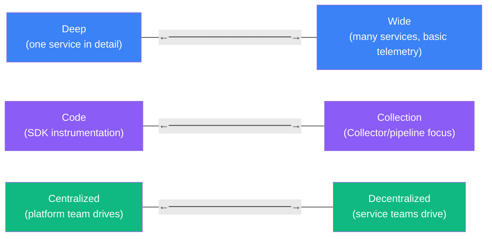
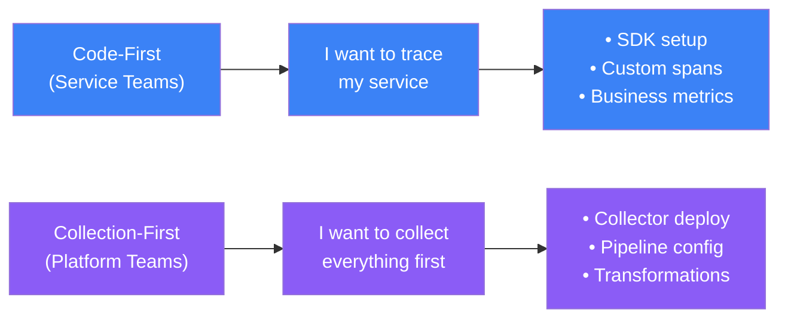
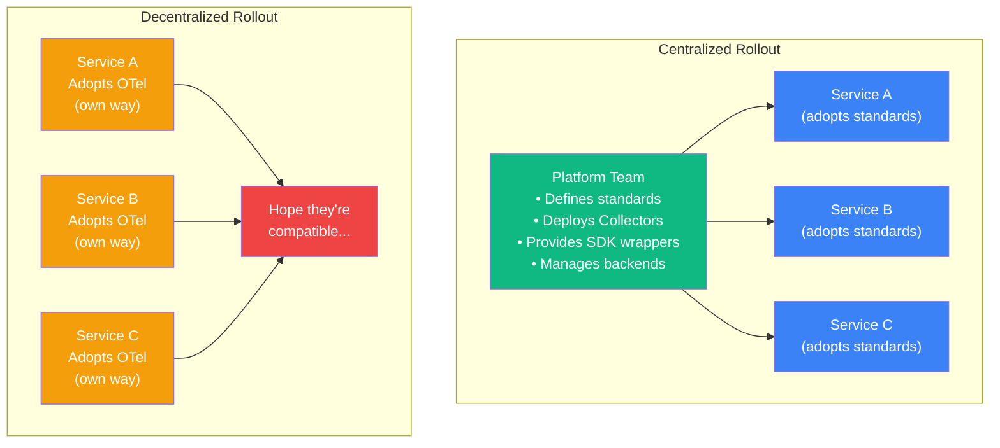
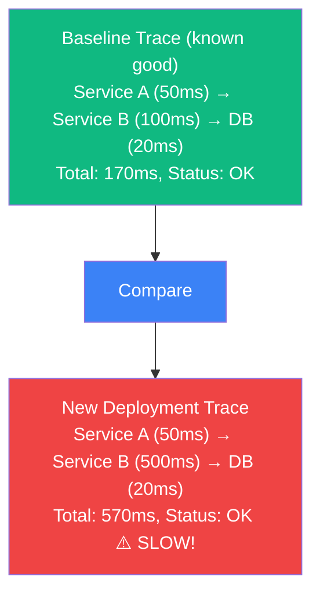
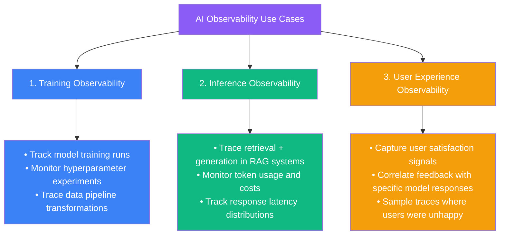
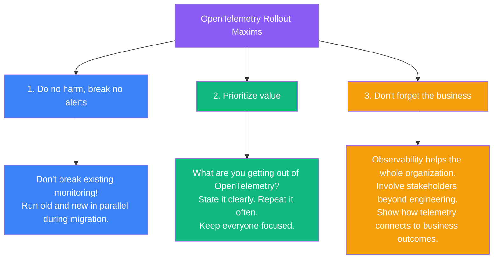

import { FlowDiagram, ComparisonDiagram, LayerDiagram, PipelineDiagram } from '@site/src/components/diagrams';

# 🚀 Chapter 9: Rolling Out Observability

> **"Just because the standard provides a cliff in front of you, you are not necessarily required to jump off it."**
>
> — Norman Diamond

---

## 📋 Table of Contents

1. [Introduction](#1-introduction)
2. [The Three Axes of Observability](#2-the-three-axes-of-observability)
   - 2.1. [Deep vs. Wide](#21-deep-vs-wide)
   - 2.2. [Code vs. Collection](#22-code-vs-collection)
   - 2.3. [Centralized vs. Decentralized](#23-centralized-vs-decentralized)
3. [Moving from Innovation to Differentiation](#3-moving-from-innovation-to-differentiation)
   - 3.1. [Observability as Testing](#31-observability-as-testing)
   - 3.2. [Green Observability](#32-green-observability)
   - 3.3. [AI Observability](#33-ai-observability)
4. [OpenTelemetry Rollout Checklist](#4-opentelemetry-rollout-checklist)
5. [Summary](#5-summary)

---

## 1. Introduction

**In plain English:** Adopting OpenTelemetry isn't just a technical decision—it's an organizational transformation that requires buy-in, planning, and strategy.

**In technical terms:** Rolling out observability requires balancing technical implementation with organizational change management across multiple dimensions.

**Why it matters:** The most common failure mode for observability initiatives isn't technical—it's organizational. Good strategy prevents stalled rollouts and wasted effort.

---

## 2. The Three Axes of Observability

Every rollout decision falls along one of three axes:



### 2.1. Deep vs. Wide

**Deep:** Detailed instrumentation of a few services
**Wide:** Basic instrumentation of many services

```
When to Go Deep
───────────────

You should go DEEP when:

✓ You're on a service team with limited scope
✓ You don't control the platform
✓ You have a specific problem to solve
✓ You want quick value for your team

Example: Financial services company with GraphQL challenges
─────────────────────────────────────────────────────────────
• Team owned GraphQL layer but not other services
• GraphQL embeds errors in response bodies (hard to trace)
• Deep instrumentation of GraphQL revealed hidden failures
• Integrated with other teams' tracing headers for context
```

```
When to Go Wide
───────────────

You should go WIDE when:

✓ You're on a platform/infrastructure team
✓ You have broad organizational authority
✓ The system is relatively homogeneous
✓ You need system-wide visibility first

Example: SaaS startup migrating from OpenTracing
─────────────────────────────────────────────────
• Small team, homogeneous stack (Go + Kubernetes)
• Existing observability infrastructure to leverage
• Migrated entire fleet in weeks
• Key challenge: "Break no alerts" during migration
```

| Approach | Pros | Cons |
|----------|------|------|
| **Deep** | Quick wins, specific value | Limited scope, silos |
| **Wide** | System-wide visibility | Longer rollout, coordination needed |

### 2.2. Code vs. Collection

**Code:** Focus on SDK instrumentation in applications
**Collection:** Focus on Collector pipelines and infrastructure



**Ideal approach:** Both, evolving together

```
eBay's Approach (2021)
──────────────────────

1. Platform team evaluated Collector for metrics/logs collection
   └── Collector replaced existing agents with better performance

2. Service teams adopted SDK for tracing
   └── Collector infrastructure already in place

3. Both evolved together
   └── Collector-first paved the way for code instrumentation
```

> **💡 Insight**
>
> If you're doing a proof of concept, code-first gets quick wins. For production rollout, Collector-first provides infrastructure for everyone to use.

### 2.3. Centralized vs. Decentralized

**Centralized:** Platform team drives adoption
**Decentralized:** Service teams adopt independently



**Case Study: Farfetch (2000+ engineers)**

```
Farfetch's Centralized Approach
───────────────────────────────

1. Platform team deployed Collector-first (Kubernetes DaemonSets)

2. Teams self-selected into OTel by adding annotations
   └── Automatic instrumentation injection

3. Platform team focused on:
   ├── Data quality improvements
   ├── Pipeline optimization
   ├── Custom processors
   └── Semantic convention guidelines

4. Service teams focused on:
   └── Adding business-specific instrumentation
```

> **💡 Insight**
>
> Successful rollouts usually start at the top. Without executive sponsorship, observability becomes "20% time" that never gets done.

---

## 3. Moving from Innovation to Differentiation

OpenTelemetry is crossing from early adopters to mainstream. What's next?

### 3.1. Observability as Testing

**Use traces to validate system behavior:**



**Applications:**
- Canary deployments with trace comparison
- Performance regression detection
- Quality gates in CI/CD pipelines

### 3.2. Green Observability

**Environmental impact of software:**

```
Emerging Metrics
────────────────

Traditional Observability:
• Latency, Throughput, Error Rate

Green Observability (emerging):
• CO2 emissions per request
• Energy consumption per transaction
• Cloud carbon footprint
• Compute efficiency scores
```

> **💡 Insight**
>
> FinOps (Financial Operations) work is creating standards for cloud cost metadata. Future regulations (especially EU) may require emissions tracking. OpenTelemetry is well-positioned to capture this data.

### 3.3. AI Observability

**Observing AI/ML systems has unique requirements:**



---

## 4. OpenTelemetry Rollout Checklist

### ✅ Essential Checklist for Success

```
Organizational Readiness
────────────────────────

□ Is management involved?
  • They manage priorities and backlogs
  • Without them, this becomes "spare time" work
  • Executive sponsor provides air cover

□ Have you identified a small but important first goal?
  • Pick a specific, valuable transaction
  • Example: "Checkout flow in our e-commerce app"
  • Use this as your guide star

□ Are you implementing only what you need for the first goal?
  • Don't boil the ocean
  • Trace works only when EVERY service in a transaction has OTel
  • Focus on the critical path first

□ Have you found a quick win?
  • Instrument end-to-end, find ONE improvement
  • Use this success to inspire other teams
  • Momentum matters more than perfection

□ Have you centralized observability?
  • Shared SDK wrapper/library
  • Common Collector configuration
  • Reduces per-team setup burden

□ Have you created a knowledge base?
  • Organization-specific documentation
  • Installation guides for your stack
  • Troubleshooting playbooks

□ Can your old and new systems overlap?
  • Run both during migration
  • Don't create observability blackouts
  • Switch over gradually
```

### The Golden Rules



---

## 5. Summary

### 🎓 Key Takeaways

1. **Choose your axis positions** — Deep/Wide, Code/Collection, Central/Decentralized all matter

2. **Executive sponsorship is critical** — Without it, rollouts stall

3. **Start small, prove value, expand** — Quick wins create momentum

4. **Don't break existing monitoring** — Run systems in parallel during migration

5. **Create organizational infrastructure** — Knowledge bases, shared libraries, standards

6. **Think beyond today** — Observability as testing, green computing, AI are coming

### 🎉 Congratulations!

You've completed the OpenTelemetry Guide. You now understand:

- ✅ Why observability matters for modern systems
- ✅ What OpenTelemetry provides (traces, metrics, logs, context)
- ✅ How the architecture works (API, SDK, Collector)
- ✅ How to instrument applications and libraries
- ✅ How to observe infrastructure
- ✅ How to design telemetry pipelines
- ✅ How to roll out observability organizationally

### 🚀 What's Next?

1. **Pick your first goal** — A specific transaction to instrument end-to-end
2. **Set up the Collector** — Even a simple local Collector gets you started
3. **Add auto-instrumentation** — Quick wins with minimal code changes
4. **Iterate and expand** — Use success to drive broader adoption

**Remember: You've got this! Now go build something observable.**

---

**Previous:** [Chapter 8: Designing Telemetry Pipelines](./chapter-8-designing-pipelines) | **Back to:** [Introduction](/)
