# 🎯 OpenTelemetry Guide

> **"History is not the past but a map of the past, drawn from a particular point of view, to be useful to the modern traveler."**
>
> — Henry Glassie

Welcome to the **OpenTelemetry Guide** — your comprehensive resource for mastering modern observability in distributed systems.

---

## 📋 Table of Contents

1. [What You'll Learn](#1-what-youll-learn)
2. [Who This Guide Is For](#2-who-this-guide-is-for)
3. [How to Use This Guide](#3-how-to-use-this-guide)
4. [Prerequisites](#4-prerequisites)
5. [Guide Structure](#5-guide-structure)

---

## 1. What You'll Learn

**In plain English:** How to see inside your applications and understand what's happening when things go wrong (or right).

**In technical terms:** How to implement comprehensive observability using OpenTelemetry's unified approach to traces, metrics, and logs in distributed systems.

**Why it matters:** Modern systems are too complex for guesswork. OpenTelemetry gives you the visibility needed to debug issues in minutes instead of hours.

This guide will teach you:

- 🧠 **Core concepts** — Understand the philosophy behind modern observability
- 🔧 **Practical implementation** — Instrument your applications step by step
- 🌊 **Pipeline design** — Build efficient telemetry collection systems
- 🚀 **Organizational rollout** — Deploy observability across your entire organization

> **💡 Insight**
>
> OpenTelemetry isn't just another monitoring tool — it's the industry standard for creating high-quality, correlated telemetry data. All major cloud providers (AWS, Azure, GCP) now support it.

---

## 2. Who This Guide Is For

This guide is designed for:

| Role | What You'll Gain |
|------|-----------------|
| **Software Engineers** | Instrument your code to emit meaningful telemetry |
| **DevOps/SRE Teams** | Design and operate telemetry pipelines |
| **Platform Engineers** | Build observability into your infrastructure |
| **Technical Leaders** | Plan organizational adoption strategies |

---

## 3. How to Use This Guide

```mermaid
graph TD
    A["📖 Part I: Foundations<br/>(Chapters 1-4)"] --> B["Build mental models"]
    B --> C["🔧 Part II: Implementation<br/>(Chapters 5-7)"]
    C --> D["Get hands-on experience"]
    D --> E["🚀 Part III: Operations<br/>(Chapters 8-9)"]
    E --> F["Scale your practice"]

    style A fill:#3b82f6,color:#fff
    style B fill:#3b82f6,color:#fff
    style C fill:#8b5cf6,color:#fff
    style D fill:#8b5cf6,color:#fff
    style E fill:#10b981,color:#fff
    style F fill:#10b981,color:#fff
```

**If you're new to OpenTelemetry:** Start with Part I (Foundations) to build a solid mental model before diving into implementation.

**If you're already familiar with observability:** Jump directly to the chapter most relevant to your current task.

---

## 4. Prerequisites

To get the most from this guide, you should have:

- ✅ Basic understanding of distributed systems concepts
- ✅ Familiarity with at least one programming language
- ✅ Experience with containerized applications (helpful, not required)
- ✅ Access to a development environment for hands-on exercises

---

## 5. Guide Structure

### 📖 Part I: Foundations

Build your mental model of modern observability:

| Chapter | Topic | Key Concepts |
|---------|-------|--------------|
| [Chapter 1](./chapter-1-state-of-observability) | State of Modern Observability | Distributed systems, telemetry types, the "three pillars" problem |
| [Chapter 2](./chapter-2-why-opentelemetry) | Why Use OpenTelemetry? | Hard vs soft context, telemetry layering, semantic telemetry |
| [Chapter 3](./chapter-3-opentelemetry-overview) | OpenTelemetry Overview | Traces, metrics, logs, context propagation |
| [Chapter 4](./chapter-4-architecture) | Architecture Deep Dive | API, SDK, Collector, demo application |

### 🔧 Part II: Implementation

Get hands-on with instrumentation:

| Chapter | Topic | Key Concepts |
|---------|-------|--------------|
| [Chapter 5](./chapter-5-instrumenting-applications) | Instrumenting Applications | SDK setup, providers, configuration |
| [Chapter 6](./chapter-6-instrumenting-libraries) | Instrumenting Libraries | Native instrumentation, library best practices |
| [Chapter 7](./chapter-7-observing-infrastructure) | Observing Infrastructure | Cloud providers, Kubernetes, serverless |

### 🚀 Part III: Operations

Scale your observability practice:

| Chapter | Topic | Key Concepts |
|---------|-------|--------------|
| [Chapter 8](./chapter-8-designing-pipelines) | Designing Telemetry Pipelines | Collector topologies, filtering, sampling |
| [Chapter 9](./chapter-9-rolling-out-observability) | Rolling Out Observability | Adoption strategies, organizational patterns |

---

> **💡 Insight**
>
> OpenTelemetry represents a fundamental shift in how we approach observability. Rather than three separate "pillars" (logs, metrics, traces), it weaves them into a single "braid" of correlated data — making it possible for computers to help us find patterns we'd never spot with our eyes alone.

---

**Ready to begin?** Start with [Chapter 1: The State of Modern Observability](./chapter-1-state-of-observability) →
